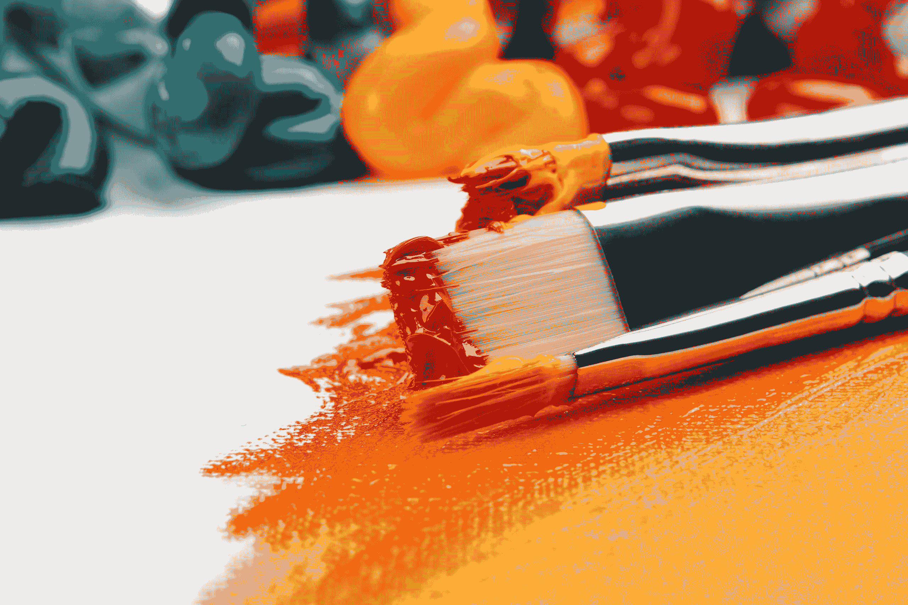
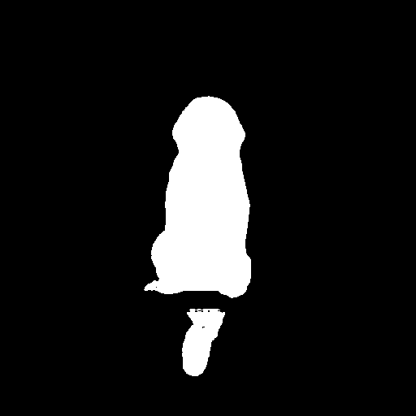
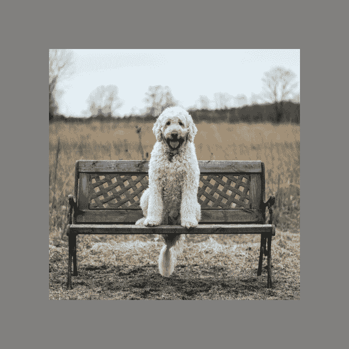

# 使用 Diffusers 进行图像修复和扩展

> 原文：[`machinelearningmastery.com/inpainting-and-outpainting-with-diffusers/`](https://machinelearningmastery.com/inpainting-and-outpainting-with-diffusers/)

图像修复和扩展是流行的图像编辑技术。您已经看到如何使用 WebUI 进行图像修复和扩展。您也可以使用代码完成相同的操作。

在本篇文章中，您将看到如何使用 Hugging Face 的 diffusers 库运行 Stable Diffusion 流水线以执行图像修复和扩展。

完成本教程后，您将学习到

+   如何使用 diffusers 的对应流水线进行图像修复

+   如何将图像扩展问题理解为图像修复的特殊形式

使用我的书籍[《掌握数字艺术与稳定扩散》](https://machinelearningmastery.com/mastering-digital-art-with-stable-diffusion/)**启动您的项目**。它提供了**自学教程**和**有效代码**。

让我们开始吧。



使用 Diffusers 进行图像修复和扩展

图片由[Anna Kolosyuk](https://unsplash.com/photos/three-silver-paint-brushes-on-white-textile-D5nh6mCW52c)提供。保留所有权利。

## 概述

本教程分为两个部分；它们是

+   使用 Diffusers 库进行图像修复

+   使用 Diffusers 库进行图像扩展

## 使用 Diffusers 库进行图像修复

我们在[之前的帖子](https://machinelearningmastery.com/inpainting-and-outpainting-with-stable-diffusion/)中讨论了图像修复的概念，并展示了如何使用 WebUI 进行图像修复。在本节中，您将看到如何使用 Python 代码完成相同的操作。

在这篇文章中，您将使用 Google Colab，因为这样您不需要拥有 GPU。如果您决定在本地运行代码，可能需要一些小的修改。例如，您可以直接调用 `cv2.imshow()` 函数，而不是使用 Google 修改过的 `cv2_imshow()` 函数。

图像修复要求您对需要重建的图像区域进行遮罩，并使用能够填充缺失像素的模型。您将使用以下方法，而不是在图像上绘制遮罩：

+   Meta AI 的 SAM ([Segment Anything Model](https://github.com/facebookresearch/segment-anything))，一个非常强大的图像分割模型，您将利用它来生成输入图像的遮罩。

+   来自 Hugging Face 库的 `StableDiffusionInpaintPipeline` 用于文本引导的稳定扩散修复

首先，您应该在 Google Colab 上创建一个笔记本并设置为使用 T4 GPU。在笔记本的开头，您应该安装所有依赖项并加载检查点 ViT-B（URL: [`dl.fbaipublicfiles.com/segment_anything/sam_vit_b_01ec64.pth`](https://github.com/facebookresearch/segment-anything)）以用于 SAM。

以下代码应首先运行：

```py
import numpy as np
import torch
import cv2
from PIL import Image
from google.colab.patches import cv2_imshow

!pip install 'git+https://github.com/facebookresearch/segment-anything.git'
from segment_anything import sam_model_registry, SamPredictor

!pip install diffusers accelerate
from diffusers import StableDiffusionInpaintPipeline

!wget -q -nc https://dl.fbaipublicfiles.com/segment_anything/sam_vit_b_01ec64.pth
CHECKPOINT_PATH='/content/sam_vit_b_01ec64.pth'

DEVICE = torch.device('cuda:0' if torch.cuda.is_available() else 'cpu')
MODEL_TYPE = "vit_b"
```

接下来，您可以将图像上传到 Colab 进行重建。您可以通过点击左侧工具栏上的“文件”图标，然后从本地计算机上传文件来方便地完成此操作：


Google Colab 的左侧面板允许您上传文件。

你上传的文件在目录`/content/`下。提供完整路径加载图像，并将其转换为 RGB 格式：

```py
# Give the path of your image
IMAGE_PATH = '/content/Dog.png'
# Read the image from the path
image = cv2.imread(IMAGE_PATH)
cv2_imshow(image)
# Convert to RGB format
image_rgb = cv2.cvtColor(image, cv2.COLOR_RGB2BGR)
```

这是开始的示例图像：


执行修补的示例图片

现在加载您已经下载的 SAM 模型的检查点。在这里，您使用`SamPredictor`类来分割图像。您为要掩盖的对象提供图像坐标，模型将自动分割图像。

```py
sam = sam_model_registryMODEL_TYPE
sam.to(device=DEVICE)
mask_predictor = SamPredictor(sam)
mask_predictor.set_image(image_rgb)

# Provide points as input prompt [X, Y]-coordinates
input_point = np.array([[250, 250]])
input_label = np.array([1])

# Predicting Segmentation mask
masks, scores, logits = mask_predictor.predict(
    point_coords=input_point,
    point_labels=input_label,
    multimask_output=False,
)
```

选定的对象是图像中（250,250）位置的像素。数组`mask`是布尔数组（用于二进制图像），我们将其转换为像素值，将形状从（1,512,512）转换为（512,512,1），并将其转换为黑白版本。

```py
mask = masks.astype(float) * 255
mask = np.transpose(mask, (1, 2, 0))
_ , bw_image = cv2.threshold(mask, 100, 255, cv2.THRESH_BINARY)
cv2_imshow(bw_image)
cv2.imwrite('mask.png', bw_image)
del sam, mask_predictor   # delete models to conserve GPU memory
```

创建的掩模如下所示：



SAM 为修补生成的掩模。白色像素将被更改，黑色像素将被保留。

SAM 已经完成了生成掩模的工作，现在我们准备使用稳定扩散进行修补。

使用 Hugging Face 库中的稳定扩散模型创建管道：

```py
# Load images using PIL
init_image = Image.open(IMAGE_PATH)
mask_image = Image.open('mask.png')

pipe = StableDiffusionInpaintPipeline.from_pretrained(
    "runwayml/stable-diffusion-inpainting", torch_dtype=torch.float16
)
pipe = pipe.to(DEVICE)
```

在上述内容中，您使用了`StableDiffusionInpaintPipeline`，它仅适用于稳定扩散 1.x 修补模型。如果您不确定您的模型是否是这样的模型，您也可以尝试使用`AutoPipelineForInpainting`，看看是否可以自动找到正确的架构。

现在为重建提供提示，并等待魔法！

```py
prompt = "a grey cat sitting on a bench, high resolution"
image = pipe(prompt=prompt, image=init_image, mask_image=mask_image).images[0]
image.save('output.png')
```

此图像也是在 Colab 中的`/content`目录下创建的。现在，您可以像之前一样显示图像了：

```py
image = cv2.imread('/content/output.png')
cv2_imshow(image)
```

这就是您可能看到的内容：


修补的结果

恭喜您完成了这个快速教程！现在，真正有趣的部分开始了。这就是本短教程的全部内容，注意在示例图像中，只有一个主要对象（狗），但如果有多个对象或者您想尝试不同的掩模技术，请尝试探索`SamAutomaticMaskGenerator`或者使用相同的`SamPredictor`但带有边界框来处理不同的对象。

## 使用 Diffusers 库进行外扩。

与修补不同，在扩散库中没有专门的管道用于外扩。但事实上，外扩就像修补一样，只是对掩模和图像进行了一些修改。让我们看看如何实现这一点。

与之前相同，您需要相同的先决条件，例如使用 GPU 设置笔记本并安装 diffusers 库。但不同于使用 SAM 作为图像分割模型来创建图像内部对象的掩模，您应该创建一个掩模来突出显示图片边框**外部**的像素。

```py
# Give the path of your image
IMAGE_PATH = '/content/Dog.png'
# Read the image from the path
image = cv2.imread(IMAGE_PATH)
height, width = image.shape[:2]
padding = 100 # num pixels to outpaint
mask = np.ones((height+2*padding, width+2*padding), dtype=np.uint8) * 255
mask[padding:-padding, padding:-padding] = 0
cv2_imshow(mask)
cv2.imwrite("mask.png", mask)
```

上述代码是检查原始图像的大小（并保存到变量`height`和`width`）。然后创建一个 100 像素边框的外部绘制遮罩，使得创建的整数值数组为 255 以匹配外部绘制图像的大小，然后将中心（不包括填充）设置为零值。请注意，遮罩中的零值意味着像素不会改变。

接下来，您可以创建一个“扩展图像”，以匹配外部绘制图像的形状。与创建的遮罩一起，您将外部绘制问题转换为遮罩沿边界的修复问题。

您可以简单地用灰色填充原始边界之外的像素。您可以使用 numpy 轻松实现：

```py
# extend the original image
image_extended = np.pad(image, ((padding, padding), (padding, padding), (0, 0)), mode='constant', constant_values=128)
cv2_imshow(image_extended)
cv2.imwrite("image_extended.png", image_extended)
```

这是扩展图像的样子：



扩展图像用于外部绘制

现在您可以像上一节那样运行修复：

```py
# Load images using PIL
init_image = Image.open('image_extended.png')
mask_image = Image.open('mask.png')

pipe = StableDiffusionInpaintPipeline.from_pretrained(
    "runwayml/stable-diffusion-inpainting", torch_dtype=torch.float16
)
pipe = pipe.to("cuda")

inpaint_image = pipe(prompt="a dog on a bench in a park", image=init_image, mask_image=mask_image).images[0]
inpaint_image.save('output.png')
```

您可以按以下方式检查输出：

```py
image = cv2.imread('/content/output.png')
cv2_imshow(image)
```

结果如下：


外部绘制结果。请注意，树木已添加在侧面。

您可能会想知道为什么在外部绘制中仍然需要提供提示。这是由管道的 API 所要求的，但您可以提供一个空字符串作为提示。但确实需要描述原始图片。您可以尝试使用不同的提示来观察结果，例如“长凳上一只狗的框架图片”。

## 进一步阅读

本节提供了更多有关该主题的资源，如果您想深入了解。

+   [diffusers API manual](https://huggingface.co/docs/diffusers/main/en/index)

+   [StableDiffusionInpaintPipeline API](https://huggingface.co/docs/diffusers/main/en/api/pipelines/stable_diffusion/inpaint)

+   [Segment Anything Github](https://github.com/facebookresearch/segment-anything)

+   [Segment Anything Example Code](https://github.com/facebookresearch/segment-anything/blob/main/demo/README.md)

## 摘要

在本文中，您已经学会了使用 Diffusers 库中的稳定扩散来进行修复和外部绘制的基本构建块。特别是，您学会了如何使用`StablediffusionInpaintPipeline`和 SAM 进行图像分割，并创建修复图像的遮罩。您还学会了如何将外部绘制问题转化为修复问题，以便在 Python 代码中执行相同操作。
