# 使用 Stable Diffusion 进行 Inpainting 和 Outpainting

> 原文：[`machinelearningmastery.com/inpainting-and-outpainting-with-stable-diffusion/`](https://machinelearningmastery.com/inpainting-and-outpainting-with-stable-diffusion/)

Inpainting 和 outpainting 长期以来一直是流行且研究广泛的图像处理领域。传统的方法往往依赖复杂的算法和深度学习技术，但仍然给出了不一致的输出。然而，最近的 Stable diffusion 进展重塑了这些领域。Stable diffusion 现在在进行 inpainting 和 outpainting 时提供了增强的效果，同时保持了极其轻量化的特性。

在本文中，你将探索 inpainting 和 outpainting 的概念，并了解如何使用 Stable Diffusion Web UI 进行这些操作。

使用我的书 [掌握数字艺术与 Stable Diffusion](https://machinelearningmastery.com/mastering-digital-art-with-stable-diffusion/) **启动你的项目**。它提供了 **自学教程** 和 **可用代码**。

让我们开始吧。

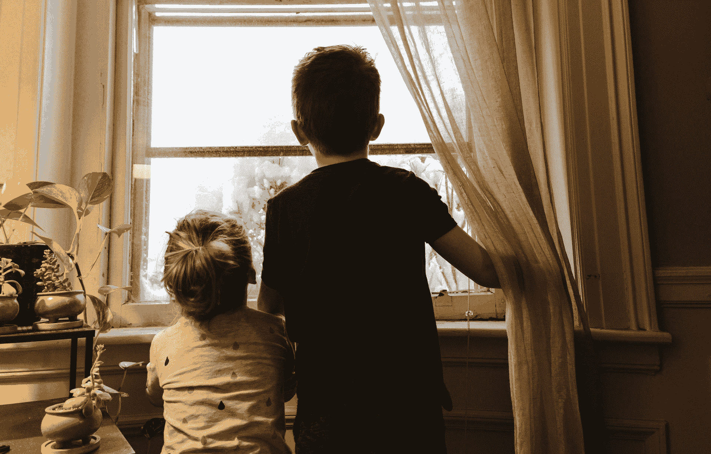

使用 Stable Diffusion 进行 Inpainting 和 Outpainting

图片由 [Kelly Sikkema](https://unsplash.com/photos/boy-and-girl-standing-near-window-looking-outside-4l2Ml8-MLUg) 提供。保留所有权利。

## 概述

本文分为五个部分，它们是：

+   Inpainting 原则

+   在 Stable Diffusion Web UI 中进行 Inpainting

+   使用 Inpaint Anything 扩展

+   Outpainting 原则

+   使用 Stable Diffusion Web UI 进行 Outpainting

## Inpainting 原则

Stable diffusion 是一种最先进的 Text2Image 生成模型。

这是一类由 Robin Robmach 等人提出的潜在扩散模型（LDM）。最初在 LAION-5B 数据库的 512×512 图像子集上训练，这个 LDM 在各种图像生成任务中展现了竞争力，包括条件图像合成、inpainting、outpainting、图像-图像转换、超分辨率等等！

与之前的扩散模型不同，后者在像素空间（原始图像）中操作，而 Stable diffusion 应用于潜在空间（压缩图像），这需要更少的计算资源，同时保持细节；这意味着你可以在本地系统上轻松运行它！

Stable diffusion 主要基于三个组件：

### 1\. 文本编码器

文本编码器将文本提示转换为嵌入空间，然后进一步用于指导去噪过程（稍后我们会详细讲解）。Stable diffusion 最初使用了一个冻结的、预训练的 CLIP ViT-L/14 来创建嵌入；然而，改进后的变体转向了 OpenCLIP，它包括参数大小为 354M+ 的文本模型，而前者 CLIP 只有 63M 参数。这使得文本提示可以更准确地描述图像。

### 2\. U-Net

U-Net 反复将有缺陷的图像转换为更干净的形式。它接收两种类型的输入：嘈杂的潜在表示（表示不完整或扭曲的图像数据）和文本嵌入（从输入文本中派生）。这些文本嵌入包含指导 U-Net 理解最终图像理想外观的文本信息。U-Net 的主要任务是预测输入中存在的噪声并减去它以生成去噪的潜在表示。与典型的 U-Net 架构不同，还包括关注层，这些层根据文本信息专注于图像的特定部分，增强去噪过程。

### 3\. 变分自动编码器（VAE）

自动编码器的解码器将 U-Net 预测（去噪的潜在表示）转换回原始像素空间，以创建最终图像。然而，在训练期间，自动编码器的编码器将高维图像（原始图像）压缩为低维潜在表示，作为输入到 U-Net 的一部分。这种压缩创建了一个更加紧凑的形式，并忽略感知上不相关的细节，从而实现了高效的计算训练。

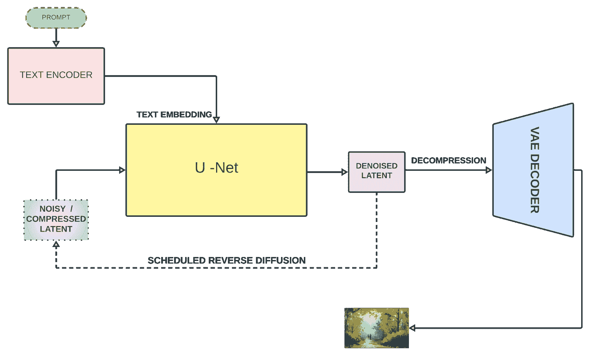

稳定的扩散架构

修补是一种流行的图像处理技术，用于恢复图像中丢失的像素，甚至重建图像的某个区域，同时遵循周围的背景（健康的像素帮助修复损坏的像素）。这是扩散模型的一个惊人特性。典型的修补过程包括：

+   确定需要重建/修复的区域。可以通过二进制图像对这些区域进行掩膜处理，以便算法识别它们。

+   然后，算法从周围像素中分析模式和纹理，以填充语义上合理和一致的区域。

让我们讨论一些重要的修补技术：

### 1\. 纹理合成

这种方法将图像分解为小补丁，分析它们的结构和纹理，并在图像内识别类似的补丁来填补缺失的区域。然而，这需要大量计算资源，并且适用于纹理均匀、一致的图像。

### 2\. 基于样本的

这种方法涉及为每个补丁评估优先级，选择最匹配的补丁，然后根据预定义的优先级利用这些补丁填补缺失区域。它在结构简单、纹理简单的缺失区域表现更好。

### 3\. 基于扩散的

它使用偏微分方程（PDE）将图像数据从周围像素扩散到缺失区域。这是一种快速有效的方法，但随着信息从周围区域扩散，可能会导致锐度或细节的丢失，在重建区域中产生模糊的外观，特别是对于较大的缺失区域。

## 使用稳定扩散 Web UI 进行修补

默认情况下，在 Stable Diffusion Web UI 中，你不仅拥有 txt2img 功能，还有 img2img 功能。回忆一下，Stable Diffusion 是通过一种随机过程生成图片，该过程将噪声逐渐转化为可识别的图片。在这个过程中，你可以基于提示施加条件。提示是 txt2img 中的文本，而在 img2img 中，它可以是图像**和**文本提示的组合。

一种进行修补的方法是使用 Web UI 中的 img2img 选项卡。在开始之前，你需要准备一个**修补模型**，它不同于普通的 Stable Diffusion 模型。例如，你可以从 Hugging Face 下载 Stable Diffusion 2 修补模型：

+   [`huggingface.co/stabilityai/stable-diffusion-2-inpainting/tree/main`](https://huggingface.co/stabilityai/stable-diffusion-2-inpainting/tree/main)

你可以简单地下载 safetensors 文件（注意，它的大小为 5.2GB）并将其放到 models/Stable-diffusion 目录中。另一个你可能觉得有用的模型（且更小，仅 2GB）是 epiCRealism Inpainting 模型：

+   [`civitai.com/models/90018/epicrealism-pureevolution-inpainting`](https://civitai.com/models/90018/epicrealism-pureevolution-inpainting)

当你学习了如何进行图像修补的原理后，你需要一种方法来遮罩要重建的图像区域，并使用一个能够填充缺失像素的模型。在 img2img 选项卡中，你可以找到“inpaint”子选项卡，你可以在这里上传一张图片。

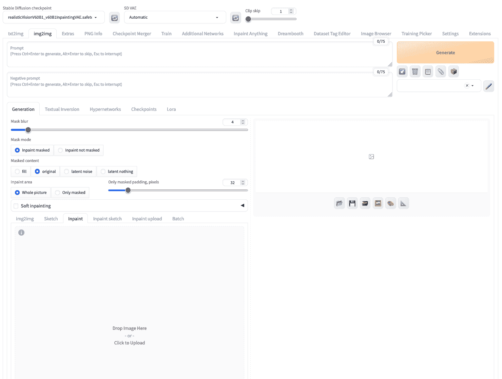

在 Stable Diffusion Web UI 中，你可以在“img2img”选项卡下的“inpaint”子选项卡中上传一张图片

让我们尝试一下以下这张狗的图片：

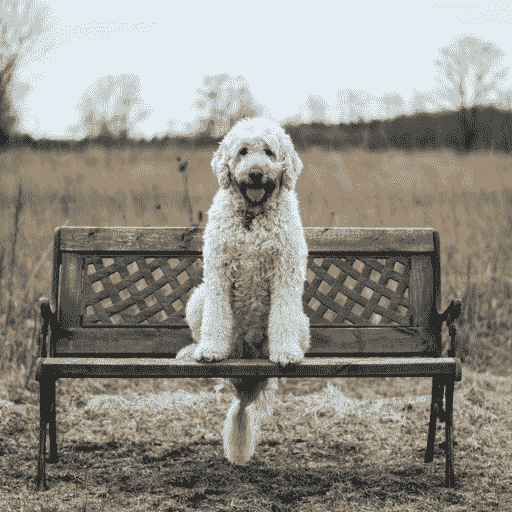

用于修补的狗的图片

上传此图片后，你可以使用鼠标“绘制”以将狗从图片中移除以创建掩码。你可以使用右上角的图标设置更大的画笔。如果你不能标记图像中狗的精细边界也不要担心，较大的掩码不是问题。例如，这就是你可能创建的：

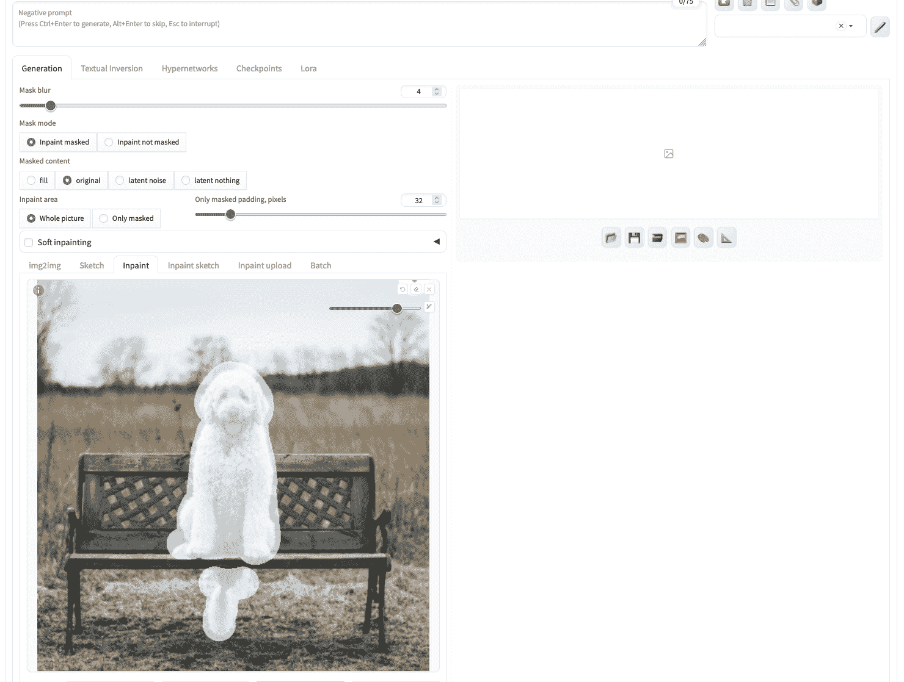

为修补创建的掩码

如果你立即点击生成，你就让修补模型自由地创建一个图片来填充被遮罩的区域。但让我们将以下内容作为文本提示：

> 一只坐着的灰色猫，高分辨率

这不是最复杂的提示，但足以告诉模型你想要什么。然后，你应该从左上角的“Stable Diffusion checkpoint”下拉菜单中选择一个修补模型。之后，点击“Generate”按钮将给你正是你描述的结果：

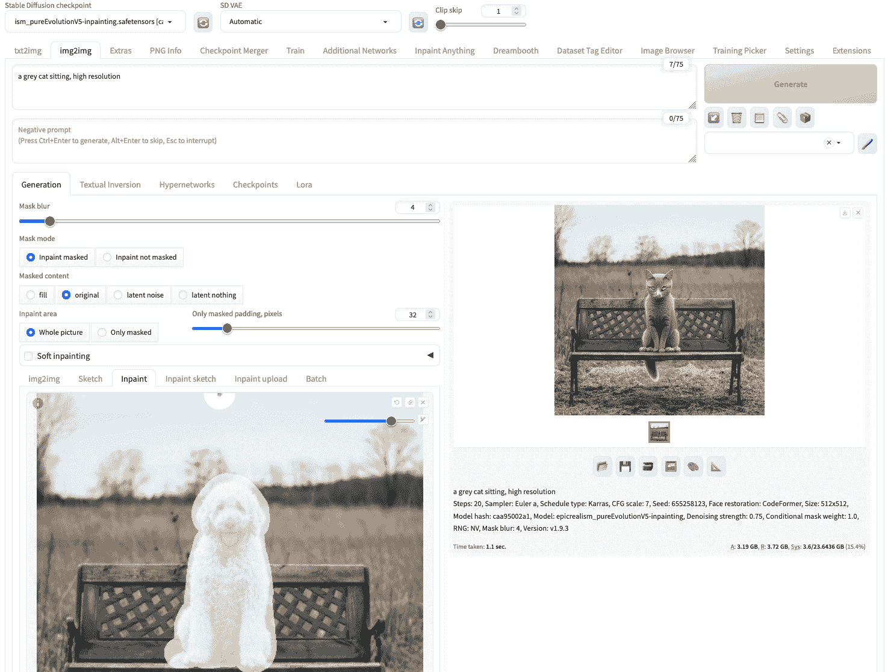

一张狗的照片被修补成猫的照片

你可能会看到不同的结果，因为图像生成过程是随机的。

图像生成的参数也适用于此，包括采样方法（例如，Euler）和采样步骤。但还有几个额外的参数需要注意：

+   输入图像和生成的图像可能具有不同的宽高比。如果需要调整大小，这会影响输出质量。你可以选择调整方法（例如，“Just resize”或“Crop and resize”）。选择“Just resize”可能会扭曲宽高比。

+   被遮罩的图像是稳定扩散模型的起点。你可以选择用噪声（“latent noise”）、保持原始像素内容（“original”），或简单地用相同颜色填充遮罩区域（“fill”）。这由“Masked content”选项控制。

+   输出图像与输入图像的相似度由“Denoising strength”控制。值为 0 将保持输入图像，值为 1 则给了修复模型最大自由度。如果你选择“original”作为“Masked content”选项，此选项的效果最为显著。

## 使用 Inpaint Anything 扩展

在图像上创建修复遮罩可能很繁琐，取决于遮罩的复杂程度。你可能会注意到在“img2img”下有一个“Inpaint upload”子选项卡，你可以将图像和遮罩作为两个图像文件上传。如果你使用了其他应用程序，如 Photoshop 来创建遮罩，这会很有帮助。

然而，还有一种更高级的创建遮罩方法，使用“Inpaint Anything”扩展。这是利用 Meta AI 的 SAM（Segment Anything Model），一个非常强大的图像分割模型，为输入图像生成遮罩。

要开始使用，请转到 Web UI 的“Extensions”选项卡。然后在“Available”子选项卡中，点击“Load from”按钮，在表格上方的搜索框中输入“inpaint anything”。应该只有一个扩展匹配此名称，你可以通过点击“Install”按钮来安装它。安装后，你需要重新启动 Web UI。

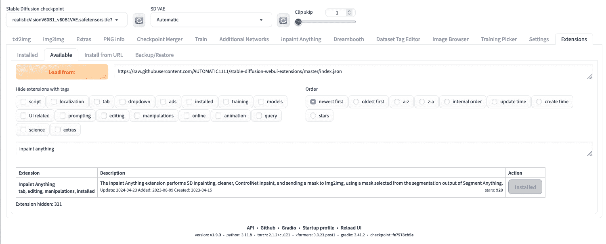

安装“Inpaint Anything”扩展

Inpaint Anything 扩展将创建一个新的同名顶级选项卡。首先，你需要选择一个 SAM 模型，例如此示例中使用的是 sam_hq_vit_l.pth。你需要在第一次运行之前下载该模型。

要开始创建修复，你可以上传你的图像，类似于在 img2img 选项卡中操作。然后，你应该点击“Run Segment Anything”按钮，这将在右侧创建一个分段图，如下所示：

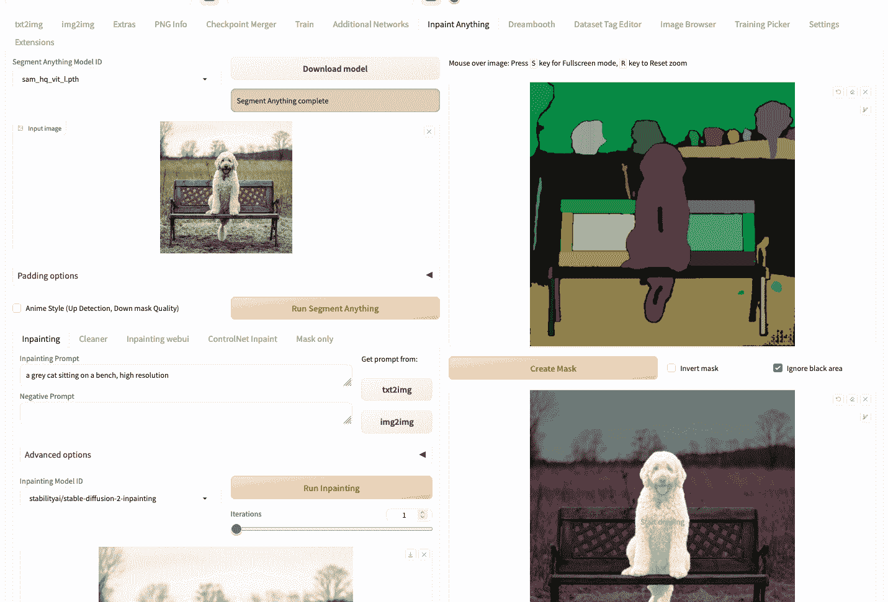

使用 Inpaint Anything 创建遮罩

接下来你需要做的是使用鼠标在与狗相对应的分段上绘制一个小划痕（正如你在上面的截图中看到的狗的胸部和尾部的短黑线）。然后点击“create mask”按钮将生成遮罩。以这种方式创建遮罩比仔细勾画图像中的狗区域要简单。

要运行修补，请返回屏幕左半部分，输入提示并点击“Run inpainting”。

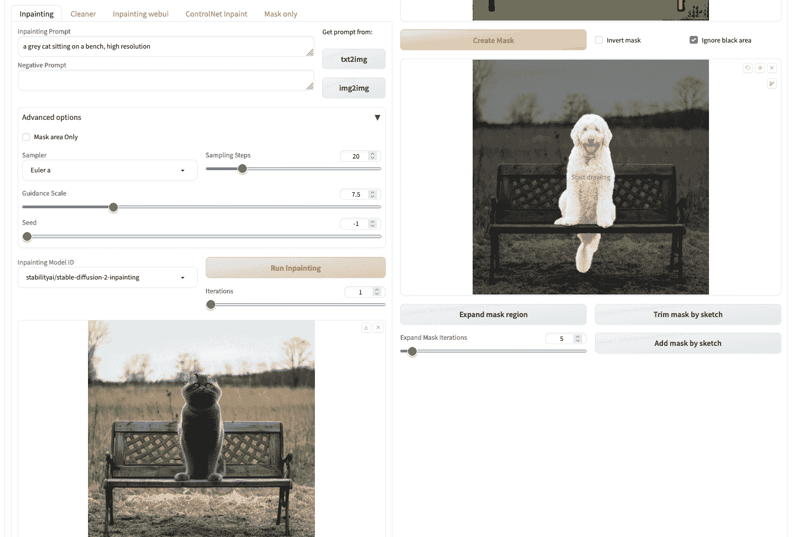

“Inpaint Anything” 的修补结果

但是，请注意，在这种情况下，您只能从下拉菜单“修补模型 ID”中选择几个模型。例如，上述示例中使用了 stable-diffusion-2-inpainting 模型。这些模型不依赖于您放置在 models/Stable-diffusion 目录中的模型文件，而是在第一次使用时从 Hugging Face Hub 下载。这是使用 Inpaint Anything 扩展的一个限制。如果您坚持使用您准备的修补模型，您可以从“仅掩模”子选项卡中检索掩模，并在“img2img”标签中重复使用它。

## Outpainting 原则

在修补图像内部像素的同时，外部绘制（outpainting）是一种推测技术，与之相反，它通过生成与原始图像在视觉上一致的新（外部）像素来扩展图像的视觉叙事。因此，现在你可以将图像延伸到其边界之外！

虽然 inpainting 得到了比 outpainting 更少的关注，但是一些基于 CNN 和 GAN 的方法仍然存在。斯坦福研究人员的方法非常有趣。他们使用了 [DCGAN](https://arxiv.org/abs/1511.06434) 作为生成器网络。他们保持了编码器-解码器结构，并通过增加扩张卷积来增强现实感，通过增加扩张因子来增强神经元的局部感受野（神经元的可访问信息），因为增加扩张因子可以增加感受野，而判别器网络由局部鉴别器组成，每个鉴别器在图像中的特定区域操作，并且通过串联层组合所有局部输出以产生最终输出。要更好地理解，请参阅此资源 [感受野](https://theaisummer.com/receptive-field/)。

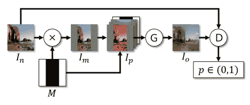

Radford 等人（2016）的训练管道

## 使用稳定扩散进行 Outpainting

Outpainting 意味着您提供一个输入图像，并生成一个输出图像，在输出图像中，输入图像是一个子图像。例如，您可以从头像生成一个半身照片。

让我们尝试在稳定扩散 Web UI 中使用这项功能。您可以像以前的工作流程一样从 img2img 标签开始您的项目。但是，您也可以从 txt2img 生成图像，并转移到 img2img。我们尝试用提示生成一张头像：

> 公园中站立的女人详细的肖像

使用适当的稳定扩散模型和其他参数，在 txt2img 标签下会生成您的输出。在生成的图片下方，您可以找到一个看起来像图片框的按钮，意思是“发送图像和生成参数到 img2img 标签”。点击这个按钮将生成的图片带到 img2img 标签，如下所示：

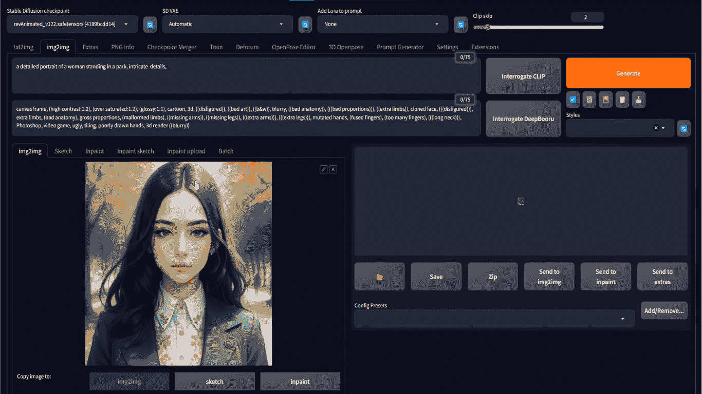

将 txt2img 结果加载到 img2img 选项卡中

在这一点上，如果您将图像上传到 img2img 选项卡，则情况与您相同。

您可以通过提示描述外部绘制的预期输出，甚至在顶部的两个文本字段中提供负面提示。您需要在 img2img 选项卡中设置输出大小。例如，如果输入图像为 512×512 像素，则可以将输出设置为 512×768 像素。

然后，最重要的步骤是滚动到页面底部，在“脚本”部分选择“穷人的外部绘制”或任何外部绘制脚本。

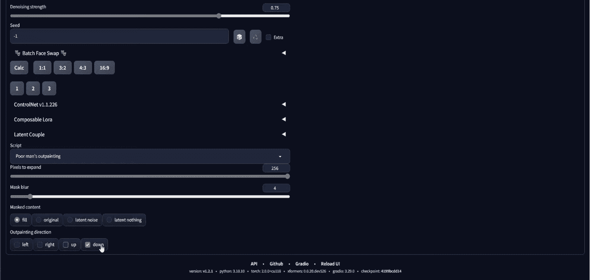

在“脚本”下拉菜单中选择“穷人的外部绘制”

您需要设置要在输入图像边界之外绘制的像素数。您还需要设置希望扩展图像的外部方向。在上面的截图中，它设置为仅在向下方向上进行 256 像素的外部绘制。请注意，由于输入为 512×512 像素，并且外部绘制将在底部添加 256 像素，因此输出将为 512×768 像素，这就是我们设置输出大小的原因。

当您完成所有参数设置后，可以单击“生成”以获取您的输出。由于生成过程中涉及随机性，您可能需要多次生成输出，直到您对结果满意。这就是您可能会得到的内容：

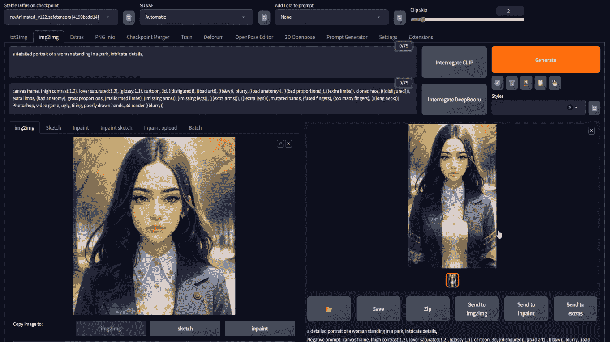

外部绘制的结果

您的输出可能与原始图像自然地融合不一致。您应该调整去噪强度，并找出适合您的最佳选项。

这是您的最终输出。但是没有什么能阻止您再次运行此过程。（注意下面输出的“发送到 img2img”按钮？）您可以重复此过程以创建全身像，但请记住，您需要使输出“更长”以适应输出。

## 外部绘制的替代方案

稳定扩散展示了令人印象深刻的外部绘制结果，但在当前生成 AI 浪潮中，值得一提的还有其他两个竞争对手。但是，只有稳定扩散是免费的！

### Dall-E

Dall-E 由[OpenAI](https://openai.com/)开发，它们也是基于输入提示生成图像的 text2img 模型，目前有三个变种：Dall-E 1、Dall-E 2 和 Dall-E 3。[Dall-E 的外部绘制](https://openai.com/blog/dall-e-introducing-outpainting)通过考虑图像的阴影、反射和纹理来保持图像的上下文。

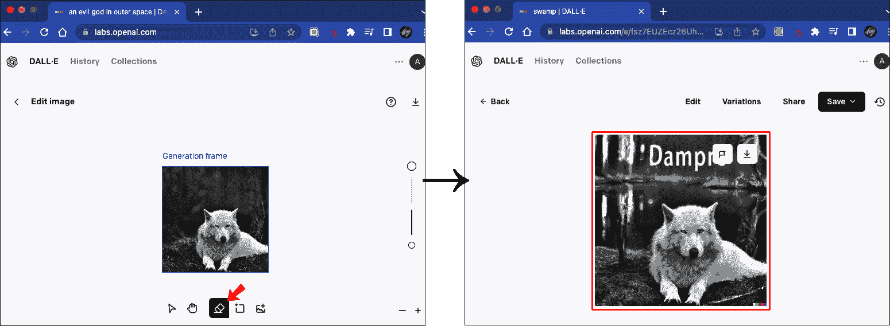

图像来自[Alphr](https://www.alphr.com/outpaint-dalle/)

### Midjourney

Midjourney 机器人是由 Midjourney 发布的另一款领先图像生成器，这是一家独立研究实验室，您可以通过他们的[discord 服务器](https://docs.midjourney.com/docs/quick-start)访问它。它在其 V5.2 版本中引入了名为“缩放”功能的[Zoom-out feature](https://docs.midjourney.com/docs/zoom-out)。

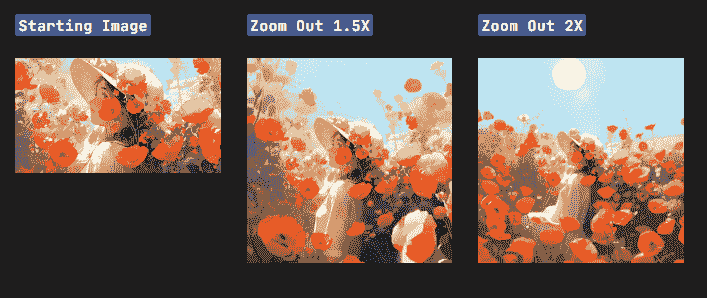

图片由[Midjourney](https://docs.midjourney.com/docs/zoom-out)提供

## 进一步阅读

如果您希望深入了解该主题，本节提供了更多资源。

+   [使用潜在扩散模型进行高分辨率图像合成](https://arxiv.org/abs/2112.10752)，由 Rombach 等人（2022）撰写

+   [LAION-5B](https://laion.ai/blog/laion-5b/) 数据集

+   [无监督表示学习与深度卷积生成对抗网络](https://arxiv.org/abs/1511.06434)，由雷德福德等人（2016）撰写

+   [理解深度卷积网络的接受域](https://theaisummer.com/receptive-field/)

## 摘要

在本文中，您已经了解了稳定扩散的基本架构及其组成部分，特别是它们如何应用于修补和外延任务。稳定扩散已被证明是生成 AI 领域中的强大工具。除了 txt2img 生成外，它在修补和外延方面也很受欢迎。automatic1111 的 Web UI 是稳定扩散的首选工具，您可以使用 img2img 标签进行修补或外延。
