# Stable Diffusion 的提示技巧

> 原文：[`machinelearningmastery.com/prompting-techniques-stable-diffusion/`](https://machinelearningmastery.com/prompting-techniques-stable-diffusion/)

在所有情况下，使用 Stable Diffusion 生成图片都涉及向管道提交一个提示。这只是众多参数中的一个，但却是最重要的一个。一个不完整或构造不良的提示可能会使生成的图像与预期不符。在这篇文章中，你将学习一些构造提示的关键技巧，并看到一个好的提示能够创造出好的图像。

**通过我的书** [《掌握 Stable Diffusion 的数字艺术》](https://machinelearningmastery.com/mastering-digital-art-with-stable-diffusion/) **来启动你的项目**。它提供了 **自学教程** 和 **可运行的代码**。

让我们开始吧。

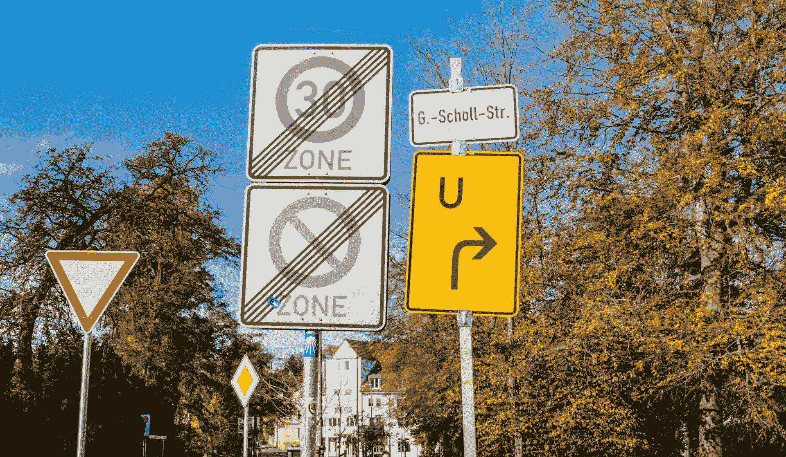

Stable Diffusion 的提示技巧

图片由 [Sangga Rima Roman Selia](https://unsplash.com/photos/zone-and-u-turn-road-signs-Y4EQtlfOLm4) 拍摄。保留部分权利。

## 概述

本文分为三个部分，它们是：

+   影响输出的参数

+   有效提示的特点

+   强调关键词

## 影响输出的参数

有几个参数会影响 Stable Diffusion 的输出。模型对绘画风格有很大的影响。采样器和步骤数量对生成质量有影响。但提示则指导了输出的内容。

基础的 Stable Diffusion 模型适用于多种用途。但有些模型是专门训练用于特定风格的。例如，“Anything”模型可以轻松生成日本动漫风格的图片，而“Realistic Vision”模型则生成逼真的照片效果。你可以从 Hugging Face Hub 或 Civitai（推荐）下载这些模型：

+   任何东西: [`civitai.com/models/9409`](https://civitai.com/models/9409), [`huggingface.co/stablediffusionapi/anything-v5`](https://huggingface.co/stablediffusionapi/anything-v5)

+   Realistic Vision: [`civitai.com/models/4201`](https://civitai.com/models/4201), [`huggingface.co/SG161222/Realistic_Vision_V6.0_B1_noVAE`](https://huggingface.co/SG161222/Realistic_Vision_V6.0_B1_noVAE)

下载的模型应保存在 WebUI 安装目录中的 `models/Stable-diffusion` 文件夹内。当你下载一个模型时，除了注意模型本身的版本外，还要注意基础模型的版本。最常见的是 SD 1.5 和 SDXL 1.0。使用不同的基础模型可能会导致与管道其他部分的兼容性问题，包括提示的理解。

理论上，扩散模型需要数百步才能生成图像。但实际上，扩散模型是可以写成微分方程的数学模型；有方法可以近似解决这个方程。采样器和步数控制了近似解的求解方式。一般来说，步数越多，结果越准确。然而，步数的效果依赖于选择的采样器。作为一个大致的参考，大多数采样器应该使用约 20 到 40 步，以获得质量和速度之间的最佳平衡。

提示会影响输出，原因非常简单。在每一步，Stable Diffusion 中的 U-net 会使用提示来指导噪声的细化。不同的模型对提示有不同的理解，就像人们对一个词有不同的预设。然而，一条普遍的规则是，你应该以这样的方式编写提示，以限制重新解释的空间。让我们通过一些示例来了解这一点。

## 有效提示的特点

提示应该具体明确地描述需要在图像中呈现的内容。随手准备一份关键词列表可以让提示变得非常简单。我们先了解一下不同类别的关键词，然后再看每个类别的示例。

### 主体或对象

提示的核心在于描述预期图像的细节。因此，首先要先想象出来。让我们通过一个提示示例来理解这一点。

> 一位穿着 FC Barcelona 球衣的年轻女子在庆祝进球，背景有足球运动员和观众。

生成图像所选择的各种设置如下：

+   模型：Realistic Vision V6.0 B1（VAE）

+   采样方法：DPM++ 2M Keras

+   采样步骤：20

+   CFG 比例：7

+   宽 × 高：512 × 512

+   负面提示：将在后续章节中解释

+   批次大小和数量：1

使用提示在 Stable Diffusion 中生成图像

对于第一次尝试来说，还不错。

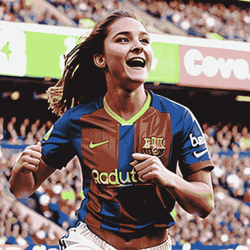

使用简单提示进行生成

让我们进一步完善这个。

**注意**：图像生成是一个随机过程。因此，你可能会看到截然不同的输出。实际上，除非你固定了随机种子，否则每次使用相同的提示和参数生成的图像都会有所不同。

### 介质

图像是如何创建的？添加图像创作介质使提示变得更加**具体**。无论图像是照片、数字画作、3D 渲染还是油画，都称为介质。

我们还可以添加一些形容词，例如：

+   超现实主义照片

+   人物数字画作

+   概念艺术

+   水下油画

让我们在提示中添加一个介质：

> 一位穿着 FC Barcelona 球衣的年轻女子在庆祝进球，背景有足球运动员和观众。

以下是结果。

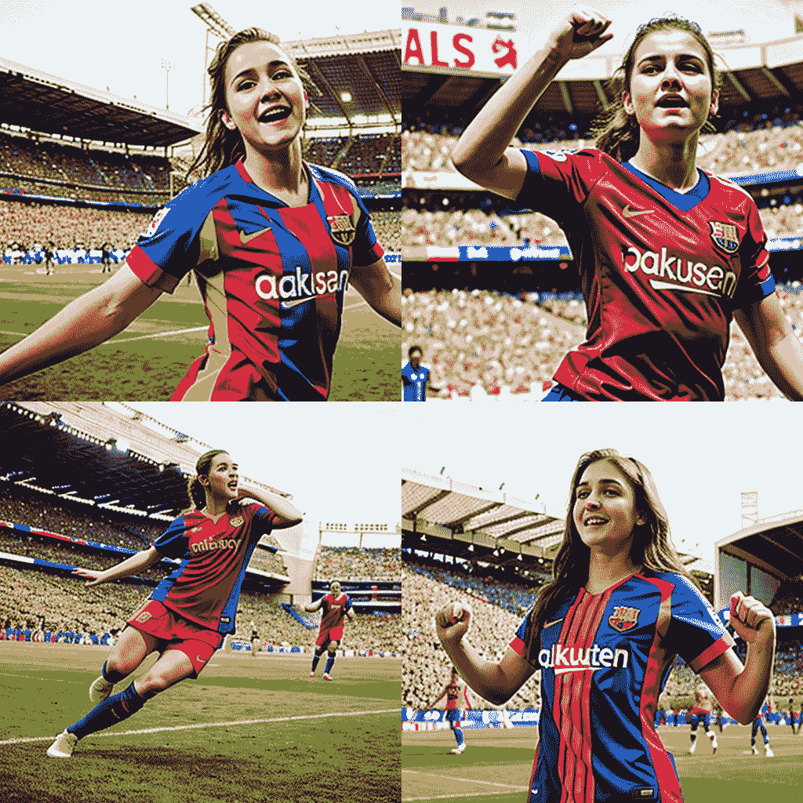

带摄影介质的提示

区别不大，因为使用的模型默认假设为逼真的摄影效果。如果使用不同的模型，区别会更明显。

### 艺术风格

现代主义、印象派、波普艺术、超现实主义、新艺术运动、超现实主义等关键词为图像增添了艺术感。让我们通过修改我们的提示来理解这一点。

> 一幅波普艺术超现实主义风格的年轻女性肖像，穿着 FC 巴萨球衣，庆祝进球，背景有足球运动员和人群。

以下是结果：

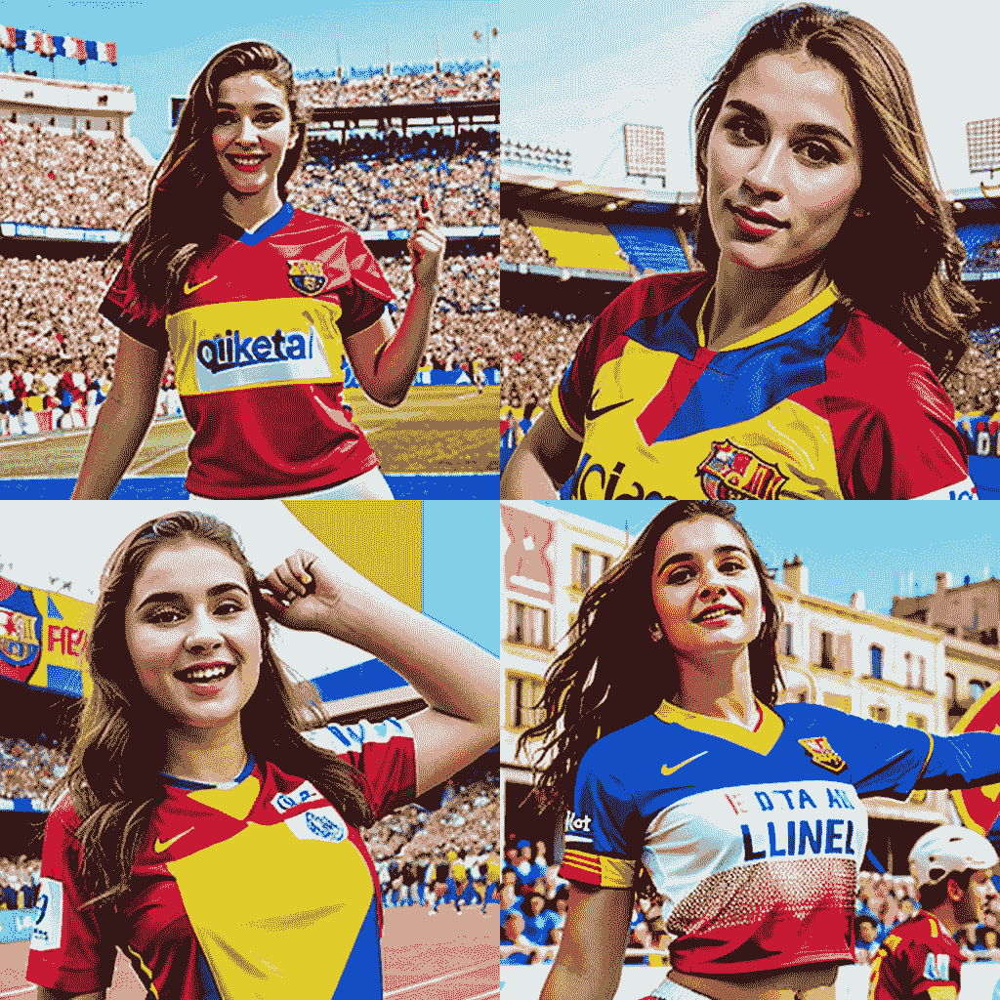

具有艺术风格的生成图像

受模型限制保持照片般的效果，但波普艺术风格使输出使用更多的主色（红色、黄色、蓝色），脸上的颜色变化更为突兀。

### 著名艺术家名字

添加艺术家名字可以选择艺术家的风格。可以提到多个艺术家名字以结合他们的风格。让我们添加两位艺术家的名字，斯坦利·阿特杰姆·劳（Stanley Artgerm Lau），一位超级英雄漫画艺术家，以及加拿大裔美国抽象画家阿格尼丝·马丁（Agnes Martin）。关于艺术家名字的好参考可以在[这里](https://stablediffusion.fr/artists)找到。

> 一幅波普艺术超现实主义风格的年轻女性肖像，穿着 FC 巴萨球衣，庆祝进球，背景有足球运动员和人群，由斯坦利·阿特杰姆·劳和阿格尼丝·马丁创作。

添加了艺术家名字到提示中

由于提供了多个艺术家名字，输出可以更具创意。

### 网站

网站如 Artstation 和 Deviant Art 有多种风格的图形。添加这些网站名称会增加特定的风格。

让我们在提示中添加“artstation”。

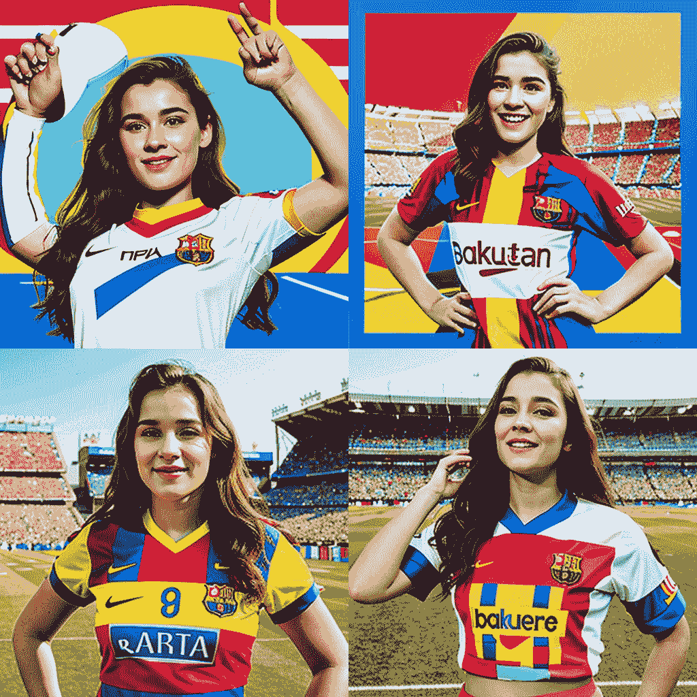

通过在提示中提供网站名称，可能会产生一些抽象背景。

### 分辨率

添加分辨率规格，如高详细度、HD、4K、8K、vray、虚幻引擎或清晰对焦，有助于获取更多图像细节。让我们尝试一下。

> 一幅波普艺术超现实主义风格的年轻女性肖像，穿着 FC 巴萨球衣，庆祝进球，背景有足球运动员和人群，由斯坦利·阿特杰姆·劳和阿格尼丝·马丁创作，artstation，4K，清晰对焦。

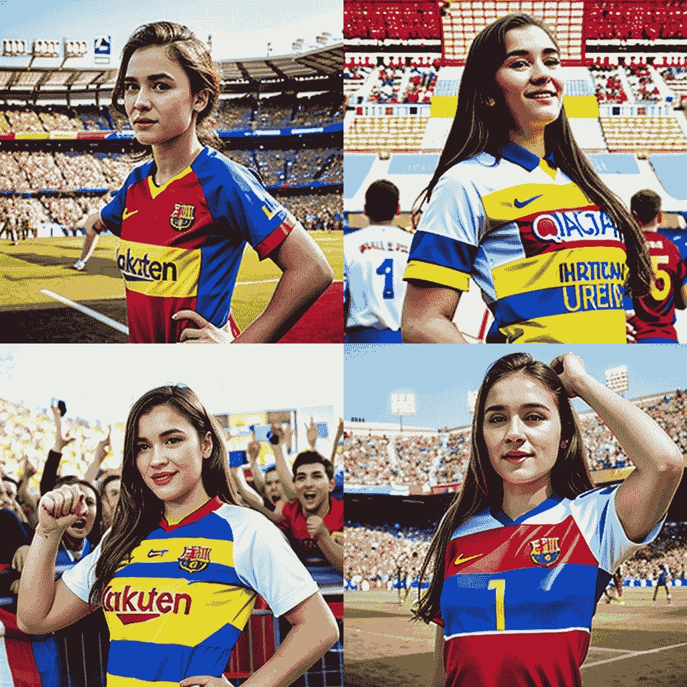

指定 4K 和清晰对焦将强调纹理细节。

你可能注意到，提示不需要是完整的句子。你也可以用逗号分隔的关键词。嵌入引擎可以很好地理解。

### 灯光

添加灯光关键词可以增强场景的外观和感觉。例如，边缘光、电影灯光、体积光、暮光射线、逆光或微光等。所以你可以将提示修改为：

> 一幅流行艺术风格的超现实主义年轻女性肖像，她穿着 FC 巴萨球衣，在背景中与足球运动员和人群一起庆祝进球，作者为 Stanley Artgerm Lau 和 Agnes Martin，artstation，4K，清晰对焦，边缘光。

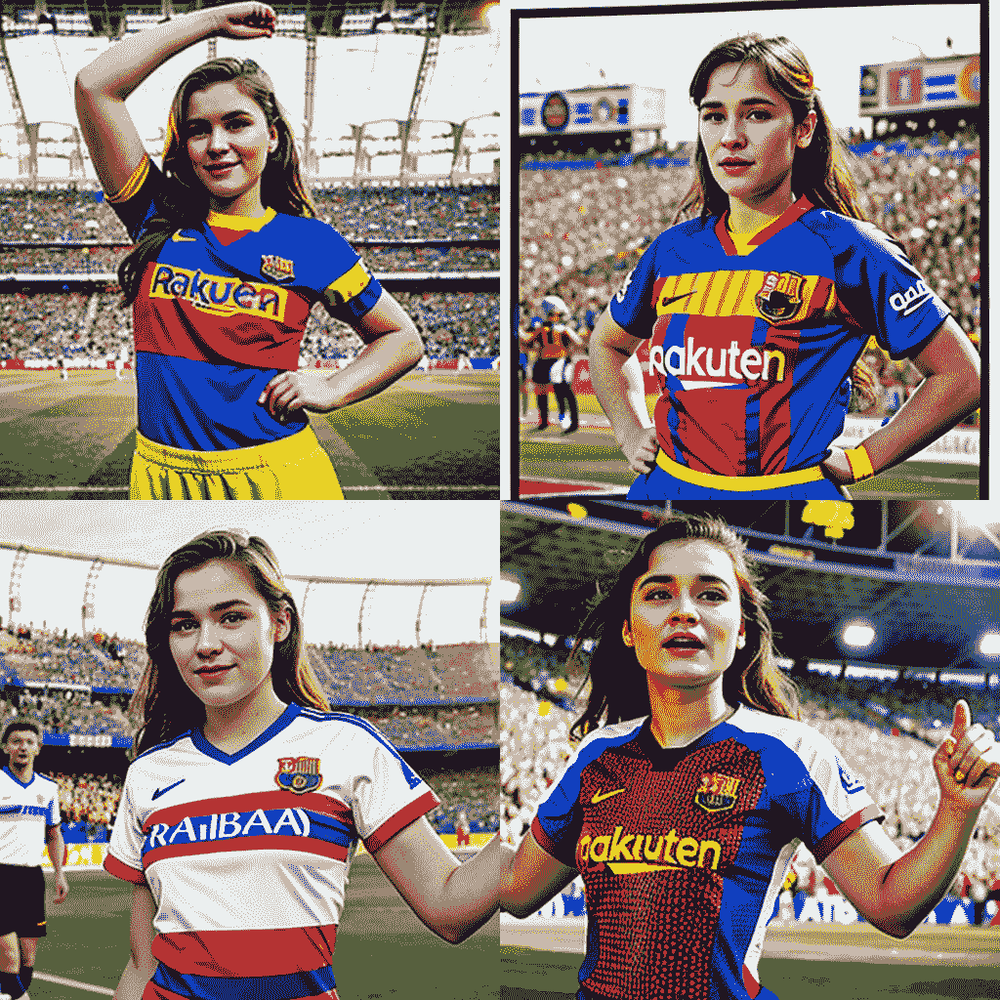

带有“边缘光”的提示将增强轮廓

如果你不熟悉摄影，边缘光就是在被摄体**后面**设置光线，使被摄体的**边缘**被光线勾勒出来。

我们还可以使用 ControlNets 或区域提示器来获得更大的控制。

### 颜色

图像的整体色调可以使用任何颜色关键词来控制。

> 一幅流行艺术风格的超现实主义年轻女性肖像，她穿着 FC 巴萨球衣，在背景中与足球运动员和人群一起庆祝进球，作者为 Stanley Artgerm Lau 和 Agnes Martin，artstation，4K，清晰对焦，边缘光，青色。

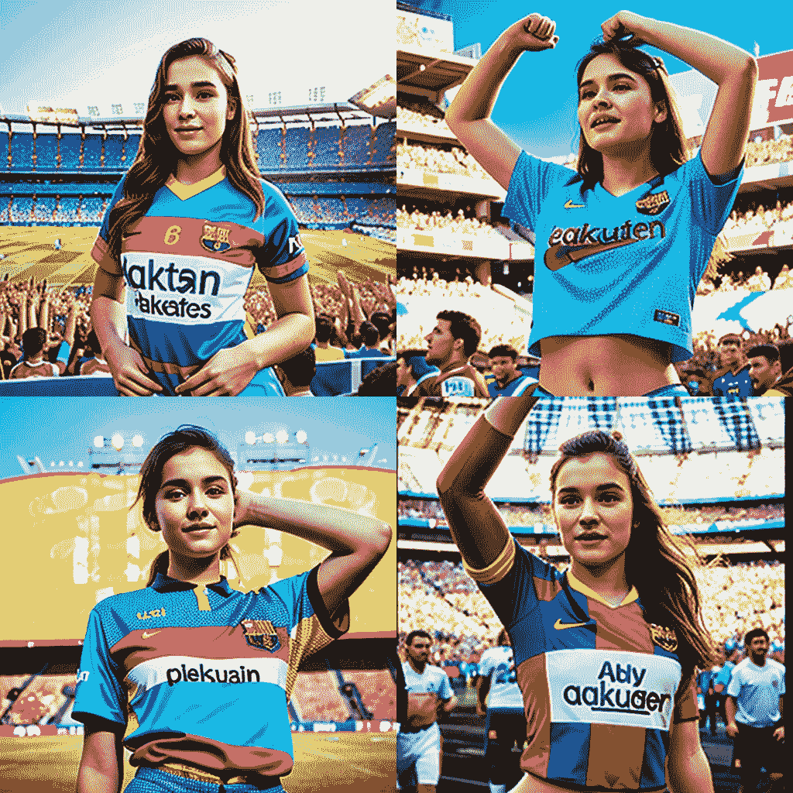

将“青色”添加到提示中将使输出中更多地出现这种颜色。

好的，我们现在可以看到图像中有一些青色。但由于提示中没有提到“青色衬衫”或“青色染发”，所以你留下了重新解释的空间，因此颜色可能出现在任何地方。

### 使用负面提示

与其描述图像中应该包含什么，不如使用负面提示描述图像中不应该出现的内容。这可以包括属性、对象或风格。我们可以为所有图像生成任务使用下面这样的通用提示。负面提示的好处是可以为负面提示保持一个标准模板，以便在多个任务中重用。但一些模型（如 SD 2.0 或 SD XL）对负面提示的依赖较小。

> （最差质量、低质量、普通质量、低分辨率、细节少、过饱和、欠饱和、过度曝光、欠曝光、灰度、黑白、糟糕照片、糟糕摄影、糟糕艺术:1.4），（水印、签名、文本字体、用户名、错误、徽标、文字、字母、数字、签名、商标、名字:1.2），（模糊、模糊、颗粒状），病态、丑陋、不对称、变异畸形、肢解、光线差、阴影差、草图、裁剪、框架外、切断、审查、JPEG 伪影、失焦、故障、重复，（喷涂、卡通、动漫、半现实主义、CGI、渲染、Blender、数字艺术、漫画、业余:1.3），（3D、3D 游戏、3D 游戏场景、3D 角色:1.1），（手部不好、解剖不好、身体不好、脸部不好、牙齿不好、手臂不好、腿部不好、畸形:1.3）

我们已经在我们的生成中使用了这个提示。

## 强调关键词

我们可以让稳定扩散知道如果我们想强调提示中的某些关键词以及程度。这可以通过以下方法实现：

### 使用因子

我们可以使用语法 (关键词:因子) 来修改关键词的权重。因子是数字值。让我们在我们的示例中试试这个。

> 由 Stanley Artgerm Lau 和 Agnes Martin 创作的一幅年轻女性 FC 巴塞罗那球衣的流行艺术超现实主义肖像（庆祝：2），背景有足球运动员和人群，艺术站，4K，清晰对焦，边缘照明，青色。

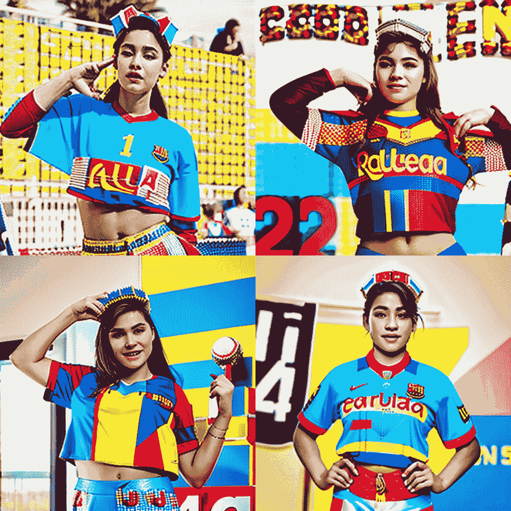

强调提示中的关键词“庆祝”。

不同于以前的生成方式。也许模型对庆祝有不同的看法。这也是为什么您需要尝试不同的提示的一个例子。

另一种增强效果的方法是使用圆括号。它与使用 1.1 倍数的效果相同。我们还可以使用双括号或三括号来增加更高的强调效果。

+   （关键词）等同于（关键词：1.1）

+   ((关键词))等同于（关键词：1.21）

+   （（（关键词）））等同于（关键词：1.33）

同样，使用多个方括号的效果是：

+   [关键词]等同于（关键词：0.9）

+   [[关键词]]等同于（关键词：0.81）

+   [[[关键词]]]等同于（关键词：0.73）

### 关键词混合

如其名称所示，关键词混合可以帮助同时结合多个主题的效果。常见的关键词混合方式如下。

+   [关键词 1：关键词 2：因子]

+   （关键词 1：因子 1），（关键词 2：因子 2）

让我们在提示中使用第二种格式。

> 一幅流行艺术超现实主义肖像，由 Stanley Artgerm Lau 和 Agnes Martin 创作，年轻女性，（加尔·加多特：0.9），（斯嘉丽·约翰逊：1.1），穿着 FC 巴塞罗那球衣庆祝进球，背景有足球运动员和人群，艺术站，4K，清晰对焦，边缘照明，青色。

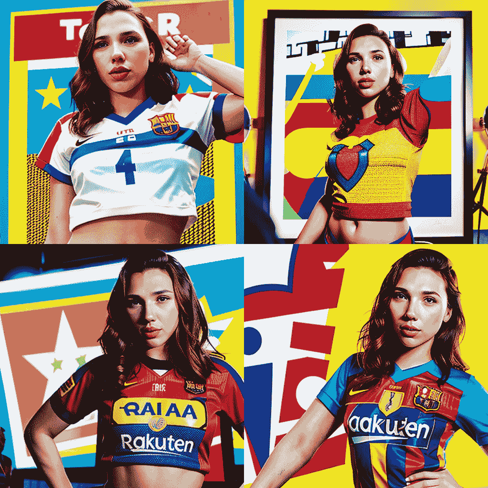

通过提示来控制脸部的外观应该是什么样子。

这是一个很好的混合。这是漫威对 DC 在足球场上的对抗。然而，看起来模型完全忘记了庆祝、人群和球员。可以通过尝试以不同的方式创建提示或重新表述来改进这一点。

最后，以下是应用相同提示的效果，但使用模型 Anything XL v5.0。这是一个面向动漫或卡通风格的模型。差异应该非常明显：

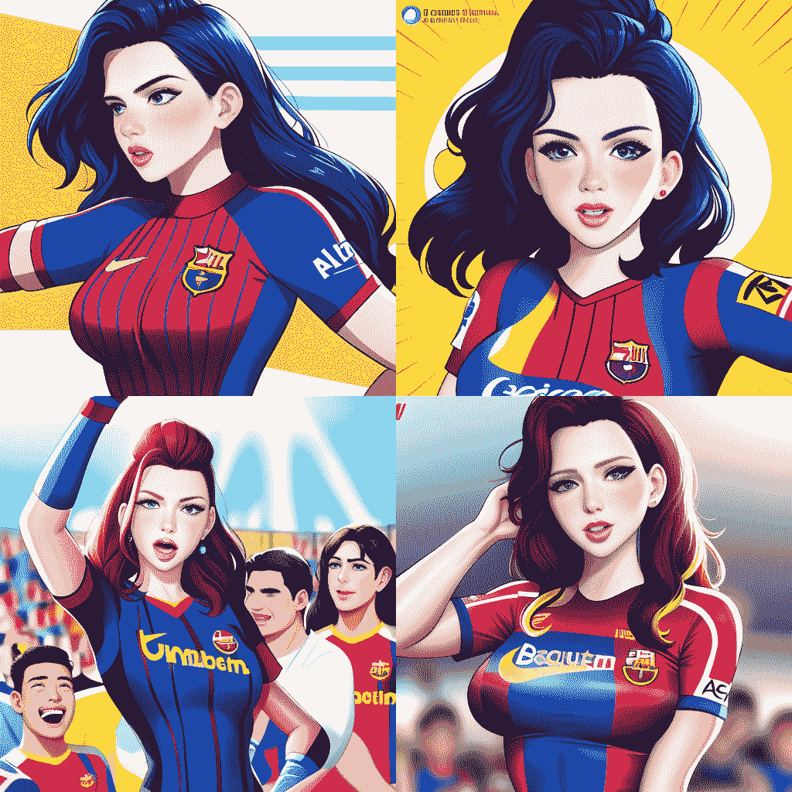

通过使用相同的提示但不同的模型获得的卡通风格

总结起来，在提示稳定扩散生成器时有很多实验可以做，专业知识只能通过实践获得。因此要不断练习！

## 进一步阅读

以下是一些可能帮助您提示的资源：

+   [Stable Diffusion 页面](https://wiki.installgentoo.com/wiki/Stable_Diffusion)来自 InstallGentoo 维基

+   [数据文件](https://github.com/pharmapsychotic/clip-interrogator/tree/main/clip_interrogator/data)来自 CLIP 审讯器源代码

## 摘要

在本文中，您学习了如何创建一个提示来使 Stable Diffusion 生成您喜欢的图片。您了解到关键是对图片进行具体描述。您的提示应包括：

+   主题：主要焦点的外观。如果描述人物的服装、动作和姿势，将会有很大帮助。

+   媒介和风格：例如，说明它是照片、素描还是水彩画。

+   一些艺术家或网站的名称，如果你希望作品具有特定风格的话。

+   分辨率和光线：通过使用 4K 分辨率和清晰的对焦，你可以获得更多的细节。描述光线也会呈现出不同的效果。

+   其他细节：你可以在提示中添加更多描述性的特征，包括主要颜色或角度。

稳定扩散生成的输出可以因许多其他参数而变化，包括模型。你需要进行实验以找到最佳的生成效果。
