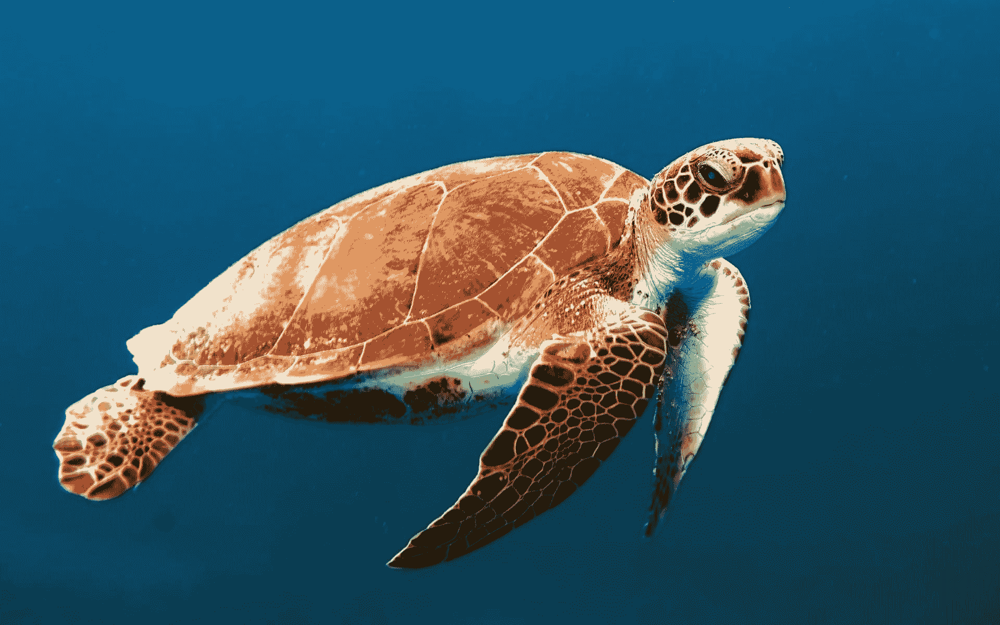
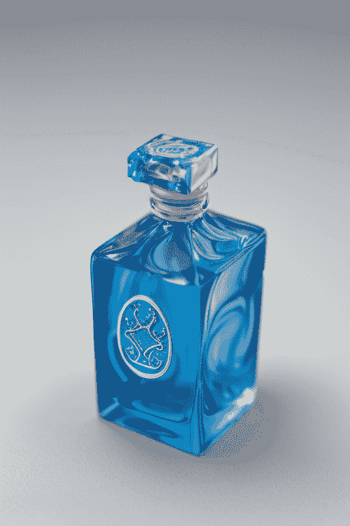
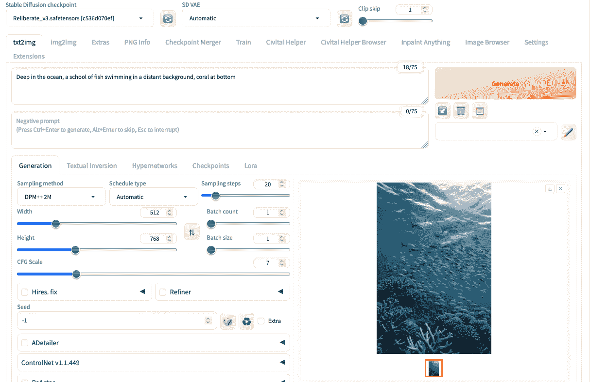
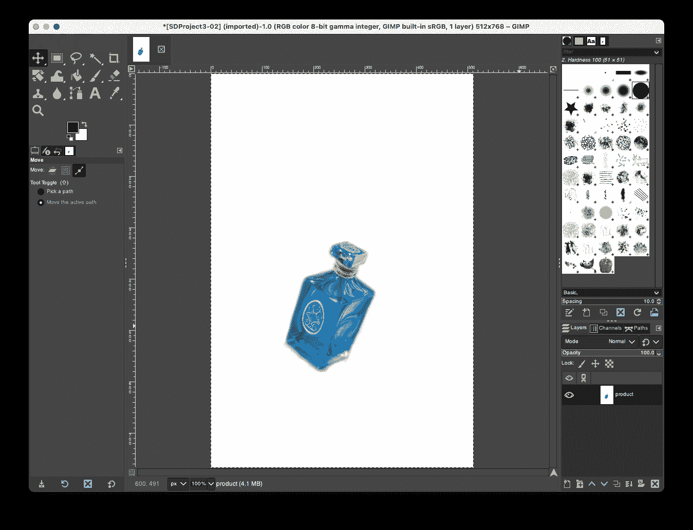
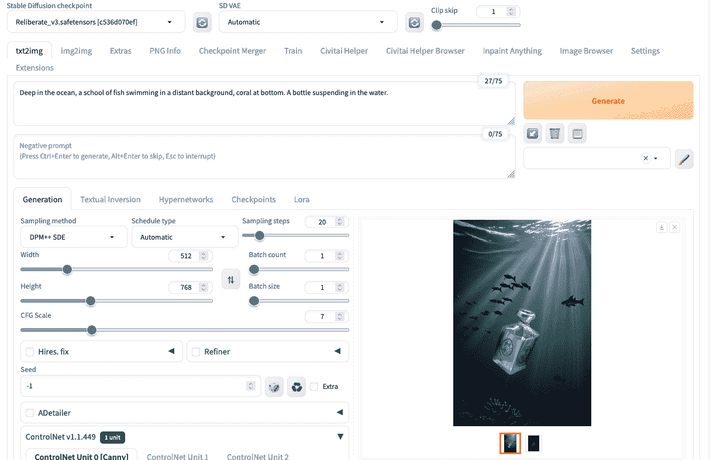
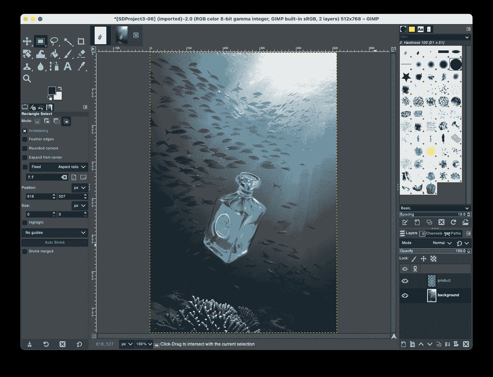
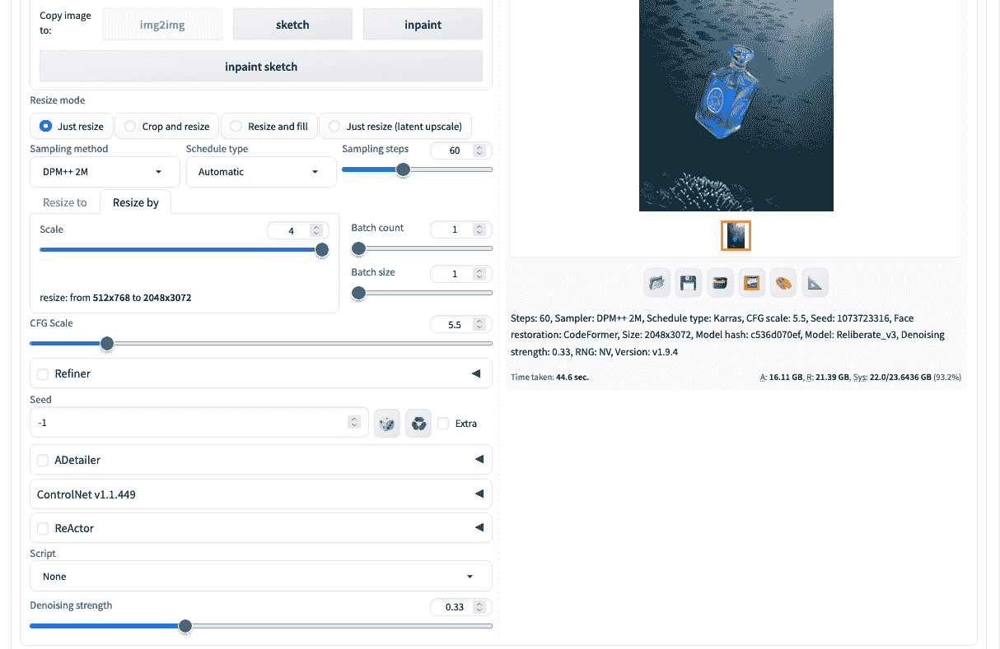
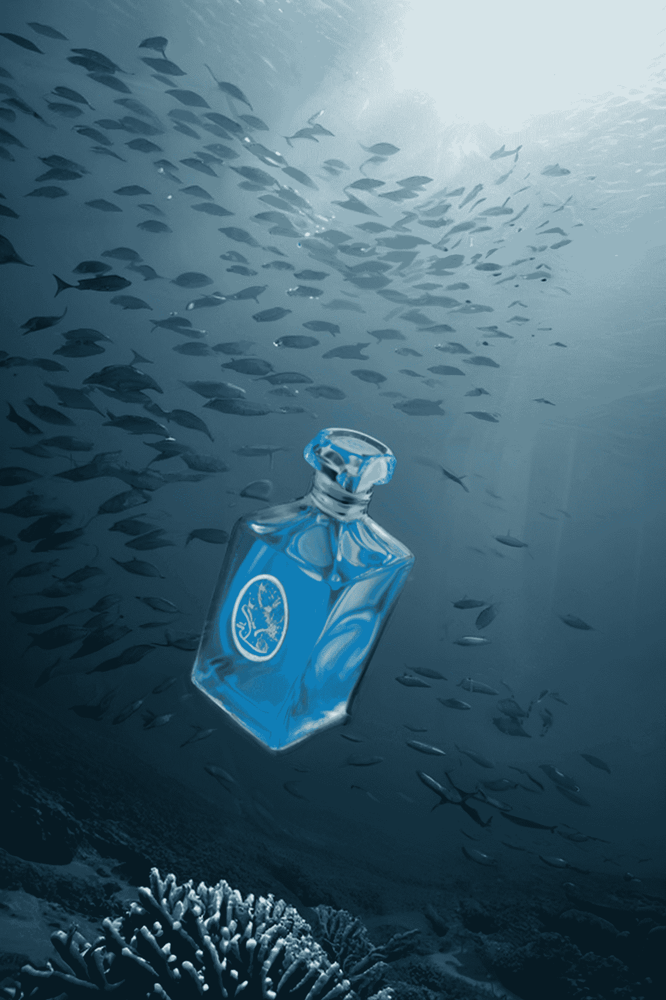

# 稳定扩散项目：商业海报

> 原文：[`machinelearningmastery.com/stable-diffusion-project-commercial-poster/`](https://machinelearningmastery.com/stable-diffusion-project-commercial-poster/)

稳定扩散已经席卷了 AI 艺术界，让用户只需几个文本提示就能生成令人惊叹和富有想象力的视觉效果。这为创意人士带来了令人兴奋的可能性，包括制作有影响力的商业海报。

在本文中，我们将深入使用稳定扩散来设计一款产品的引人注目的海报。阅读完本文后，你将学到：

+   如何准备产品的照片以供稳定扩散使用

+   如何创建吸引人的商业海报，无需复杂的绘画技巧

**用我的书 [《使用稳定扩散精通数码艺术》](https://machinelearningmastery.com/mastering-digital-art-with-stable-diffusion/) 来启动你的项目**。它提供了带有**可操作代码**的**自学教程**。

让我们开始吧

稳定扩散项目：商业海报

照片由[Wexor Tmg](https://unsplash.com/photos/brown-turtle-swimming-underwater-L-2p8fapOA8)提供。部分权利保留。

## 概述

本文分为四部分：

+   项目想法

+   创建海报的第一个草稿

+   完善海报

+   其他技巧

## 项目想法

假设你在一家化妆品公司工作，即将推出一款新香水。你有香水瓶的图片如下，想要为它制作海报。为了简单起见，假设这个海报没有文字，只考虑图形。

一瓶香水的项目（不是真实产品，而是稳定扩散生成的想象）。

这是一瓶小蓝瓶。产品主题是“海洋”，海报设计取决于你的想象力。

## 创建海报的第一个草稿

首先，让我们关注背景，因为它决定了整体海报的风格和氛围。一个简单的提示足以：

> 在海洋深处，远处背景中游动着一群鱼，海底珊瑚

测试提示以验证模型和其他参数生成符合你期望的图片。

看起来不错。让我们添加产品。

首先，你需要使用 Photoshop 或者 GIMP 创建一个模板。这是一个重要的步骤，稍后你会明白其重要性。你设置画布大小（例如，512×768 像素），白色背景，并将产品放在上面。注意，你需要调整产品的大小和角度，放置在画布上，就像你希望最终海报中的样子一样。一个示例如下：

在 GIMP 中创建海报模板

保存这张图片。然后回到 Stable Diffusion Web UI。在 ControlNet 中，上传这张图片并选择 Canny 作为控制类型。将生成的图像的宽度和高度设置为 512×768 像素。修改提示以提到瓶子，比如

> 在海洋深处，远处有一群鱼在游动，底部有珊瑚。一个瓶子悬浮在水中。

运行生成，您将看到如下图片：

利用 ControlNet 制作瓶子在海洋中的图片

您会看到生成的图片与没有使用 ControlNet 的图片不同。这是预期的，因为您改变了扩散过程。您可以尝试增加批次计数和批次大小以生成几个并选择最佳的图片。

但是在这里您有一个严重的问题：瓶子与原始瓶子不同。在这种情况下，您应该导出这张图片并进行一些编辑。还记得您在开始时创建的模板图片吗？因为它是白色背景，您可以在 Photoshop 或 GIMP 中轻松地将背景设置为透明。将新生成的图片作为背景层，将原始模板作为顶层，并移除白色背景。这样可以在背景上放置正确的产品，因为您在生成图片时使用了 Canny 类型的 ControlNet，它与大小和位置完美匹配。您将看到以下效果：

使用 GIMP 将实际产品叠加在生成的图片上

看起来正确但不完美。瓶子可能会在背景中混合得很尴尬。而且分辨率太低不能做海报。但是让我们先将其保存为中间图片。

## 完善海报

对生成的输出进行微小的修整的技巧是在 Stable Diffusion 中使用 img2img 生成。您提供没有提示的图像，并将去噪强度设置为较低但非零值，然后要求 Stable Diffusion 重新生成具有一些微小变化的同一图片。通常，这些是在看起来不自然的部分进行的修整。

在这个例子中，您可以在 img2img 选项卡上传图片，并将调整模式设置为“只调整大小”（以保持纵横比）。然后选择“按比例调整”选项并将其最大化到 4 倍比例。大多数采样方法都有效，但您希望采样步骤更多（这样每个步骤都较小，以避免图片发生剧烈变化）。您可以稍微降低 CFG 比例，但将“去噪强度”设置为 0.33。

调整海报大小作为修饰技术

结果如下所示：

生成的海报

## 其他技巧

这是一个多步骤工作流的示例。您可以在 Stable Diffusion 中探索许多功能，并将它们组合在多个步骤中以创建惊人的结果。

例如，您可以在 txt2img 步骤中使用两个 ControlNet 单元：一个用于主题，一个用于背景。您可以像上面一样使用 Canny 来处理主题。但是，与其编写详细的提示以创建背景，您可以向 ControlNet 的第二单元提供一个示例图片，并将控制类型设置为 IP 适配器。这样，示例图片的色彩方案和风格将被采用。您可以使用一个更简单的背景描述作为提示。扩散过程将知道生成什么。

记住，当您使用多个 ControlNet 单元时，必须降低所有单元的控制权重，因为对最终输出的总影响是所有权重的总和。

## 进一步阅读

如果您希望深入了解该主题，本节提供了更多资源。

+   [Reliberate 模型](https://huggingface.co/XpucT/Reliberate/tree/main) 在 Hugging Face 上

+   [ControlNet](https://github.com/lllyasviel/ControlNet) 在 GitHub 上

+   [向文本到图像扩散模型添加条件控制](https://arxiv.org/abs/2302.05543) 作者：Zhang 等人（2023）

+   [IP 适配器](https://ip-adapter.github.io/) 网站

+   [IP-适配器：文本兼容图像提示适配器用于文本到图像扩散模型](https://arxiv.org/abs/2308.06721) 作者：Ye 等人（2023）

## 摘要

在这篇文章中，您体验了一个涉及多个步骤的工作流程，通过稳定扩散来创建最终输出。您使用了 txt2img 来创建图片，使用了 img2img 函数来优化输出。您还使用了外部图片编辑器来帮助创建适用于 ControlNet 的图像。虽然没有单一工具可以完成所有工作，但您学会了如何将稳定扩散作为更大项目的构建模块。
