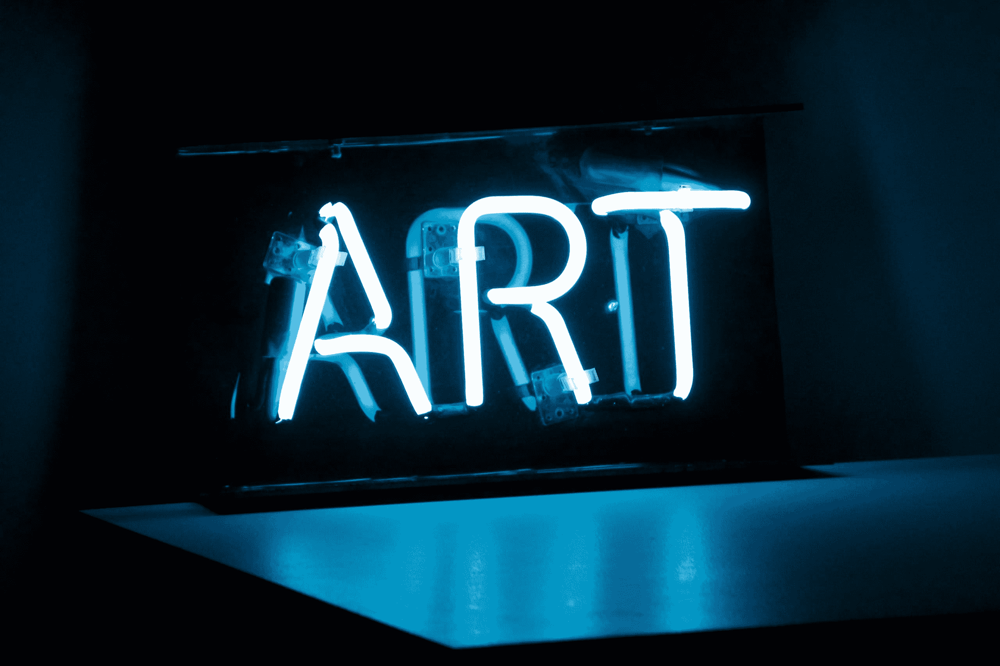
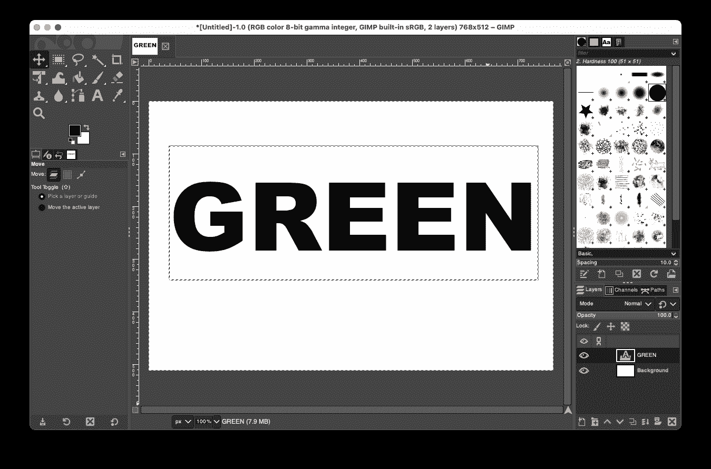
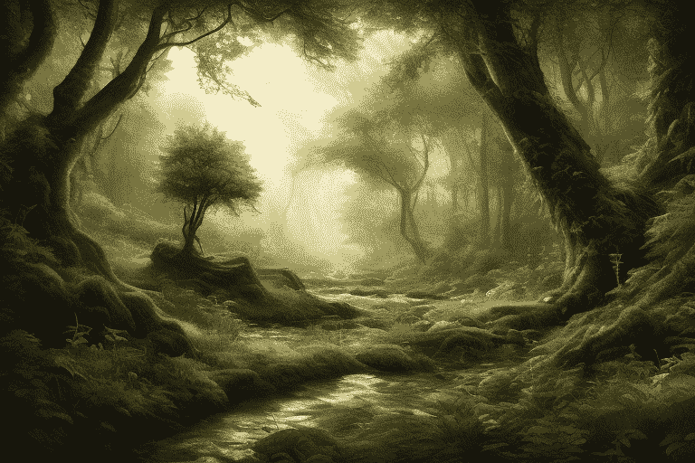
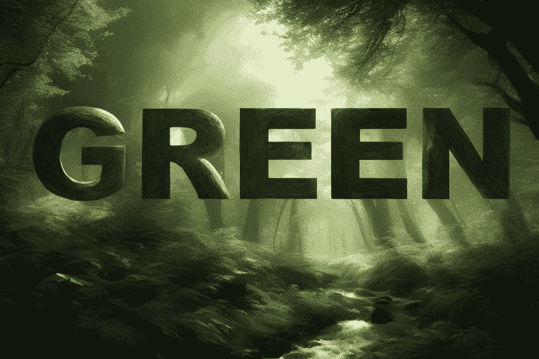
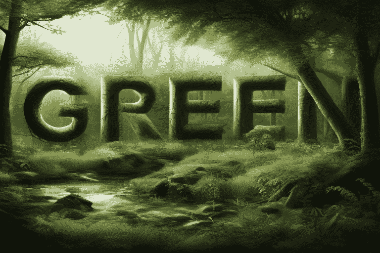
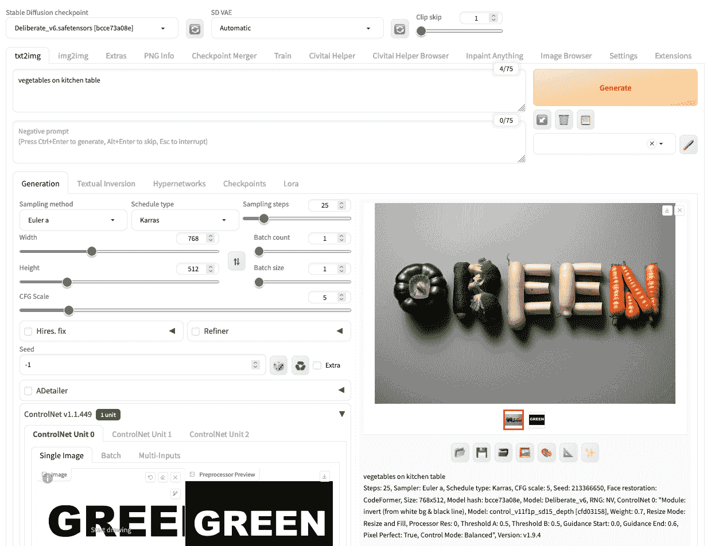

# 稳定扩散项目：文字艺术

> 原文：[`machinelearningmastery.com/stable-diffusion-project-word-art/`](https://machinelearningmastery.com/stable-diffusion-project-word-art/)

稳定扩散是一个强大的工具，可以帮助你生成图片。玩这个生成式 AI 工具很有趣。但如果这个工具能够在实际工作中帮助你，那将会很有用。在这篇文章中，你将看到如何利用稳定扩散的力量来处理一些现实和实用的事情。完成这篇文章后，你将学到：

+   决定如何使用稳定扩散的推理过程

+   在你的创意项目中，使用稳定扩散来增强其他工具

**通过我的书籍** [《掌握稳定扩散的数字艺术》](https://machinelearningmastery.com/mastering-digital-art-with-stable-diffusion/) **来启动你的项目**。它提供了**自学教程**和**有效代码**。

让我们开始吧

稳定扩散项目：文字艺术

图片由 [Zach Key](https://unsplash.com/photos/blue-art-neon-sign-turned-on-rKE6rXOl14U) 提供。保留部分权利。

## 概述

本文分为三个部分；它们是：

+   项目构思

+   创建图片

+   不同主题下的相同想法

## 项目构思

想象一下你正在进行一个项目，需要一些文字艺术。它可以是你网站的横幅或海报中的关键视觉元素。文字应该清晰可见，但图形也很重要。你怎么将字母融入图片中？你希望结果非常吸引人，而不是那种你可以轻松用 Photoshop 或 Microsoft Word 创建的效果。

让我们考虑“绿色”这个主题来保护环境。我们想要一张自然景观和“绿色”这个词的图片。看看它是如何创建的。

## 创建图片

在稳定扩散中创建自然场景非常容易，只需使用适当的提示。将文本叠加到图片上应该不太困难，因为你可以很容易地在 PowerPoint 中为图片背景添加带有阴影的文本。但让场景与文本融合则需要一些技巧，即使使用 Photoshop，也需要相当多的时间。

提供一个提示以控制图片生成，同时对图片施加额外约束的想法是 ControlNet 可以做到的。要使用 ControlNet，你需要一张图片。让我们用 GIMP 创建一张。

假设目标图片是 768×512 像素（记住 SD1 模型的默认分辨率是 512×512 像素；你不应该使尺寸差别太大）。你可以在 GIMP 中将画布设置为这个尺寸，并在白色背景上制作黑色文字“GREEN”。然后将图片保存为 PNG 格式。

创建一个白色背景和黑色文字“GREEN”的图片。

请注意，你并不一定要使用 GIMP 来创建这样的图片。你也可以在 Microsoft Word 中输入文本并截屏。这个方法唯一的问题是你不容易控制分辨率。

让我们进入 Stable Diffusion Web UI。你应该使用“text2img”功能，并选择一个 Stable Diffusion 1.x 模型（如 Deliberate_v6）。因为我们想生成自然场景，你可以设置提示词：

> 森林的自然场景，高度细致，史诗般的

并保持负面提示词为空。将图像大小设置为宽 768 像素，高 512 像素。使用这样的提示（并取决于你选择的模型、CFG 规模和采样器），你可以生成如下图片：

一张森林的图片。由作者使用 Stable Diffusion 生成。

看起来不错。现在你已经确认提示词有效，输出符合预期。让我们继续使用 ControlNet。启用 ControlNet，上传你用 GIMP 创建的图片。将“控制类型”设置为“All”，然后在预处理器中选择“反转（从白色背景和黑色线条）”，模型选择一个深度模型（如“control_v11f1p_sd15_depth”）。然后点击生成，看看效果。你可能会看到如下结果：

一张生成效果较差的图片，文字与背景融合不佳。

“GREEN”这个文本似乎没有很好地融入图片。文字有些纹理，但仍然显得生硬。这是因为你没有正确使用 ControlNet。这是 ControlNet 驱动图片生成时间过长的结果。你可以将 ControlNet 的重要性调整到 0.7，而不是 1.0。但是最重要的是，你希望 ControlNet 仅参与扩散过程的前 60% 步骤。这样，后 40% 的步骤仅使用你的提示词，但图片的轮廓已经建立。

只需这个更改，你应该能看到文字和图片的更好融合。但有时，你可能会看到文字变形，因为你给了扩散过程过多自由来改变图片的最后 40% 步骤。这将很难控制，但你可以设置更大的批量大小或生成多个批次，以检查多个随机种子的运气。以下是你可能得到的一个示例：

由 Stable Diffusion 生成的文字艺术，文字与背景融合良好。

这张图片使用了 CFG 规模为 5 的“Euler a”采样器，Karras 调度在 25 步骤上。ControlNet 的权重为 0.7，起始控制步骤为 0，结束控制步骤为 0.6。生成的图片中有一半可能会出现字母变形，但这是另一半中最好的。你可以看到树木如何形成了字母。用 Photoshop 绘制这样的效果需要很长时间。

## 相同的想法，不同的主题

“绿色”并不总是与自然有关。通过不同的提示，但保持所有其他参数相同，你可以得到不同的图片。让我们“走绿色”并推广吃蔬菜。只需将提示更改为

> 厨房桌上的蔬菜

你可以得到如下图片：

在 Stable Diffusion 中重用相同模板生成不同的图片。

实际上，这就是你应该学习如何有效使用 Stable Diffusion 的课程：通过实验不同的参数并找到最佳参数，你可以轻松地调整工作流程，创建出质量相同但完全不同的新图片。

## 进一步阅读

本节提供了更多关于该主题的资源，如果你想深入了解。

+   [ControlNet](https://github.com/lllyasviel/ControlNet) 在 GitHub 上

+   [向文本到图像扩散模型添加条件控制](https://arxiv.org/abs/2302.05543) 作者：张等（2023）

+   [Deliberate 模型](https://huggingface.co/XpucT/Deliberate) 在 Hugging Face 上

## 总结

在这篇文章中，你已经看到如何创建一个将文字自然融入背景中的字艺术图片。结果很吸引人，而手工绘制这种效果并不容易。然而，你可以使用带有 ControlNet 插件的 Stable Diffusion 快速生成这种详细的结果。
