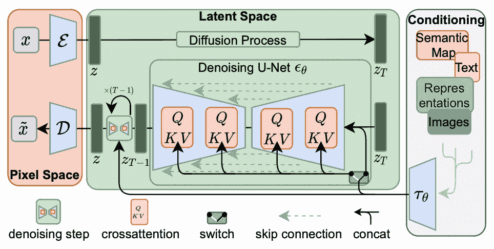

# 在稳定扩散中使用 LoRA

> 原文：[`machinelearningmastery.com/using-lora-in-stable-diffusion/`](https://machinelearningmastery.com/using-lora-in-stable-diffusion/)

稳定扩散的深度学习模型非常庞大。权重文件的大小达到数 GB。重新训练模型意味着需要更新大量权重，这是一项繁重的工作。有时我们必须修改稳定扩散模型，例如，定义新的提示解释或让模型默认生成不同风格的画作。事实上，有方法可以在不修改现有模型权重的情况下对现有模型进行扩展。在这篇文章中，你将了解低秩适配，它是修改稳定扩散行为的最常见技术。

**用我的书《掌握稳定扩散数字艺术》**来**启动你的项目**，[Mastering Digital Art with Stable Diffusion](https://machinelearningmastery.com/mastering-digital-art-with-stable-diffusion/)。它提供了**自学教程**和**可运行代码**。

让我们开始吧。

在稳定扩散中使用 LoRA

图片来源：[Agent J](https://unsplash.com/photos/green-and-brown-concrete-wall-dO1i_fWbbcw)。保留部分权利。

## 概述

本文分为三部分；它们是：

+   低秩适配是什么

+   检查点还是 LoRA？

+   LoRA 模型示例

## 低秩适配是什么

LoRA（低秩适配）是一种轻量级训练技术，用于对大型语言模型和稳定扩散模型进行微调，而无需进行完整的模型训练。对较大模型（由数十亿个参数组成）进行全面微调本质上是昂贵且耗时的。LoRA 通过向模型添加较少的新权重进行训练，而不是重新训练整个参数空间，从而显著减少了可训练参数的数量，这样可以缩短训练时间并减小文件大小（通常在几百兆字节左右）。这使得 LoRA 模型更容易存储、共享，并在消费者级 GPU 上使用。

简而言之，LoRA 就像是在现有工厂中添加一小队专业工人，而不是从头开始建立一个全新的工厂。这允许对模型进行更高效、更有针对性的调整。

LoRA 是一种由[微软研究人员](https://arxiv.org/pdf/2106.09685.pdf)提出的最先进的微调方法，用于将较大模型适配到特定概念。一个典型的全面微调涉及在神经网络的每一层中更新整个模型的权重。[Aghajanyan et al.(2020)](https://arxiv.org/abs/2012.13255) 解释了预训练的过参数化模型实际上存在于低内在维度上。LoRA 方法基于这一发现，通过将权重更新限制在模型的残差上。

假设 $W_0\in \mathbb{R}^{d\times k}$ 表示一个预训练的权重矩阵，大小为 $\mathbb{R}^{d\times k}$（即，一个有 $d$ 行和 $k$ 列的实数矩阵），它通过 $\Delta W$（**更新矩阵**）进行变化，以使微调模型的权重为

$$ W’ = W_0 + \Delta W$$

LoRA 使用这种技术，通过秩分解来降低更新矩阵 $\Delta W$ 的秩，使得：

$$

\Delta W = B \times A

$$

其中 $B\in\mathbb{R}^{d\times r}$ 和 $A\in\mathbb{R}^{r\times k}$，使得 $r\ll \min(k,d)$$。

将矩阵拆分为两个低秩矩阵

通过冻结 $W_0$（以节省内存），我们可以微调 $A$ 和 $B$，这包含了用于适应的可训练参数。这导致微调后的模型的前向传递如下：

$$

h = W’x = W_0 x + BA x

$$

对于稳定扩散微调，应用秩分解到交叉注意力层（下方阴影部分）就足够了，这些层负责整合提示和图像信息。具体来说，这些层中的权重矩阵 $W_O$、$W_Q$、$W_K$ 和 $W_V$ 被分解以降低权重更新的秩。通过冻结其他 MLP 模块并仅微调分解后的矩阵 $A$ 和 $B$，LoRA 模型可以实现更小的文件大小，同时速度更快。

稳定扩散的工作流程。交叉注意力模块可以被 LoRA 修改。

## 检查点还是 LoRA？

检查点模型是一个在训练期间保存于特定状态的完整预训练模型。它包含了训练过程中学习到的所有参数，可以用于推理或微调。然而，微调检查点模型需要更新模型中的所有权重，这可能会计算量大且文件大小较大（对于稳定扩散，通常为几 GB）。

另一方面，LoRA（低秩适应）模型要小得多且更高效。它作为一种适配器，建立在检查点模型（基础模型）的基础之上。LoRA 模型仅更新检查点模型的部分参数（增强检查点模型）。这使得这些模型体积较小（通常为 2MB 到 500MB），并且可以频繁地针对特定概念或风格进行微调。

例如，稳定扩散模型的微调可以使用 DreamBooth。DreamBooth 是一种微调方法，它更新整个模型以适应特定的概念或风格。虽然它可以产生令人印象深刻的结果，但也有一个显著的缺点：**微调模型的大小**。由于 DreamBooth 更新了整个模型，结果检查点模型可能非常大（约 2 到 7 GB），并且需要大量 GPU 资源进行训练。相比之下，LoRA 模型显著减少了 GPU 需求，但推断效果仍然与 DreamBooth 检查点相当。

虽然 LoRA 是最常见的，但它并不是唯一修改 Stable Diffusion 的方式。参见上面的工作流程，crossattention 模块接收了输入 $\tau_\theta$，通常是将提示文本转换为文本嵌入的结果。修改嵌入就是 **Text Inversions** 所做的，以改变 Stable Diffusion 的行为。Textual Inversions 甚至比 LoRA 更小、更快。然而，Textual Inversions 有一个限制：它们 **仅微调特定概念或风格的文本嵌入**。负责生成图像的 U-Net 保持不变。这意味着 Textual Inversions 只能生成与其训练图像相似的图像，无法生成超出其已知范围的内容。

## LoRA 模型的示例

在 Stable Diffusion 的背景下，有许多不同的 LoRA 模型。对它们进行分类的一种方式是基于 LoRA 模型的功能：

+   人物 LoRA：这些模型经过微调，以捕捉特定角色的外观、身体比例和表情，通常出现在卡通、视频游戏或其他媒体形式中。它们对创建粉丝艺术作品、游戏开发和动画/插图目的非常有用。

+   风格 LoRA：这些模型在特定艺术家或风格的艺术作品上进行了微调，以生成该风格的图像。它们通常用于将参考图像风格化为特定的美学。

+   服装 LoRA：这些模型在特定艺术家或风格的艺术作品上进行了微调，以生成该风格的图像。它们通常用于将参考图像风格化为特定的美学。

一些示例如下：

使用人物 LoRA “[goku black [dragon ball super]](https://civitai.com/models/62283/goku-black-dragon-ball-super?modelVersionId=66827)” 在 Civitai 上创建的图像，由 [TheGooder](https://civitai.com/images/742370) 贡献。

使用风格 LoRA “[动漫线稿/漫画风格 (线稿/線画/マンガ風/漫画风) Style](https://civitai.com/models/16014/anime-lineart-manga-like-style?modelVersionId=28907)” 在 Civitai 上创建的图像，由 [CyberAIchemist](https://civitai.com/images/326150) 贡献。

使用服装 LoRA “[动漫线稿/漫画风格 (线稿/線画/マンガ風/漫画风) Style](https://civitai.com/models/23337/urban-samurai-or-v014-or-clothing-lora?modelVersionId=27871)” 在 Civitai 上创建的图像，由 [YeHeAI](https://civitai.com/images/685315) 贡献。

找到 LoRA 模型文件最受欢迎的地方是 [Civitai](https://civitai.com/)。如果你正在使用 Stable Diffusion Web UI，你只需下载模型文件并将其放入 `stable-diffusion-webui/models/Lora` 文件夹中。

要在 Web UI 中使用 LoRA，你只需将 LoRA 的名称用尖括号括起来，作为提示的一部分。例如，上述图像之一是通过以下提示生成的：

> 最佳杰作，1girl，独自，极其荒谬的分辨率，卫衣，耳机，街头，户外，下雨，霓虹灯，微笑，帽子戴上，手插在口袋里，侧面看，线条画，单色，<lora:animeoutlineV4_16:1>

部分“<lora:animeoutlineV4_16:1>”表示使用名为`animeoutlineV4_16.safetensors`的 LoRA 模型文件，并以权重 1 应用它。注意，在提示中，除了对 LoRA 模型的引用外，并未提及线条画风格。因此，你可以看到 LoRA 模型对输出产生了巨大的影响。如果你感兴趣，你可以从 Civitai 上发布的内容中经常找到生成图片所使用的提示和其他参数。

查看在 Civitai 上发布的图片，可以在屏幕右半部分看到生成它所使用的提示和其他参数。

最后提醒，LoRA 依赖于你使用的模型。例如，Stable Diffusion v1.5 和 SD XL 在架构上不兼容，因此你需要一个与基础模型版本匹配的 LoRA。

## 进一步阅读

以下是介绍 LoRA 微调技术的论文：

+   [“LoRA: 大型语言模型的低秩适应”](https://arxiv.org/abs/2106.09685)，由 Hu 等人（2021 年）

+   [“内在维度解释语言模型微调的有效性”](https://arxiv.org/abs/2012.13255)，由 Aghajanyan 等人（2020 年）

## 总结

在这篇文章中，你了解了什么是 Stable Diffusion 中的 LoRA 以及它为何是轻量级的增强。你还了解到，使用 Stable Diffusion Web UI 中的 LoRA 就像在提示中添加一个额外的关键词一样简单。许多 Stable Diffusion 用户开发了 LoRA 模型，并在互联网上提供下载。你可以找到一个来轻松改变生成的结果，而无需过多担心如何描述你想要的风格。
